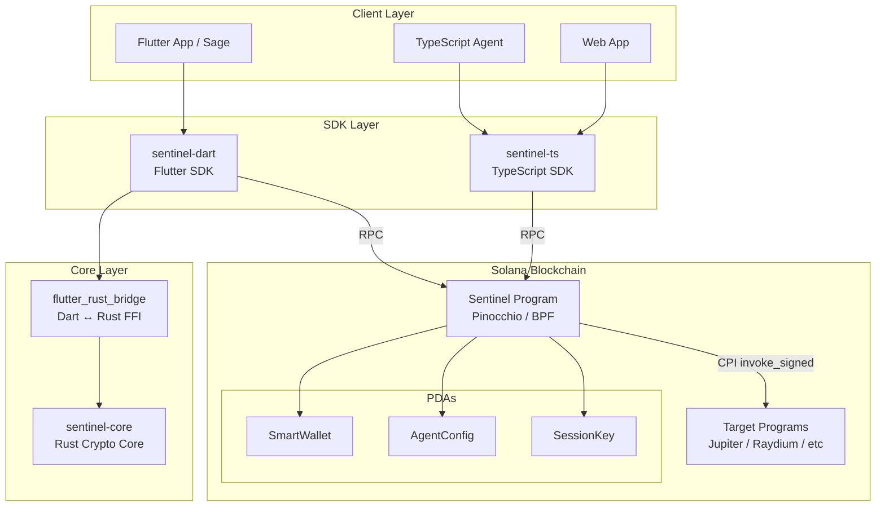
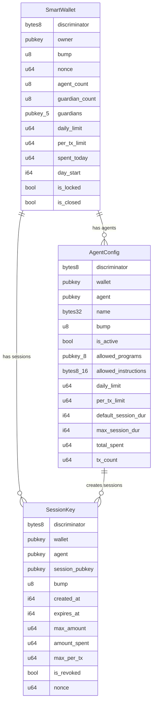
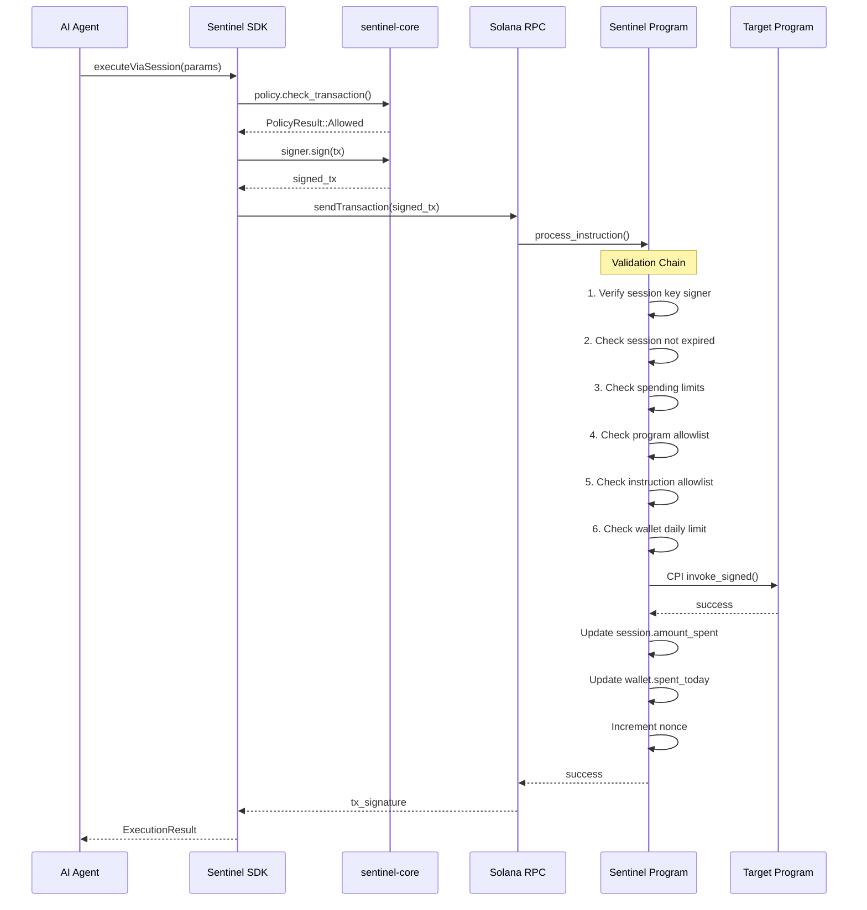
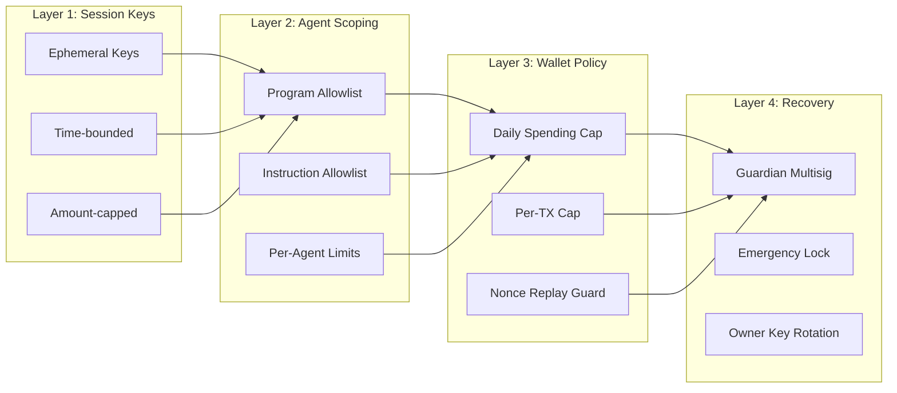
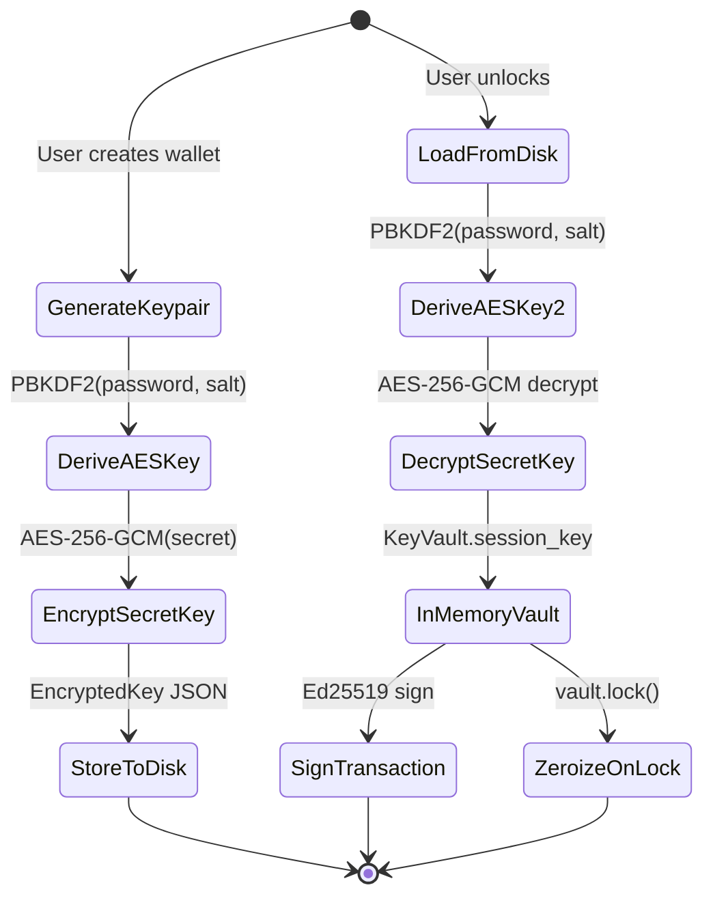
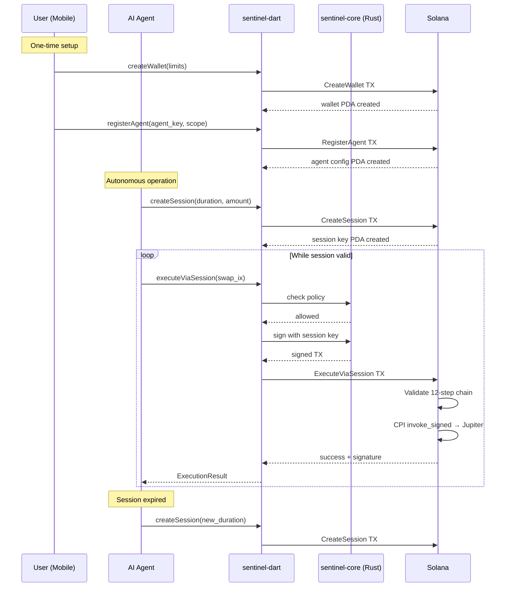
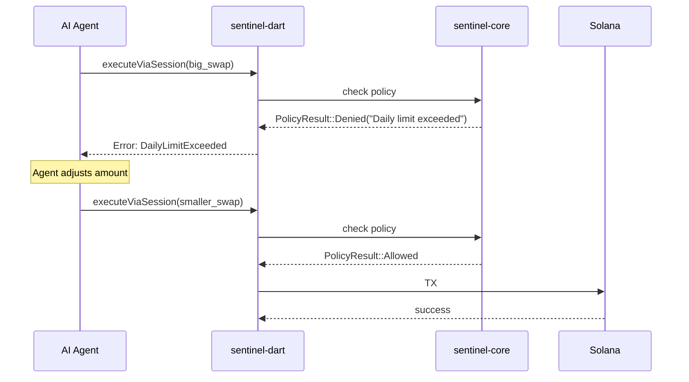
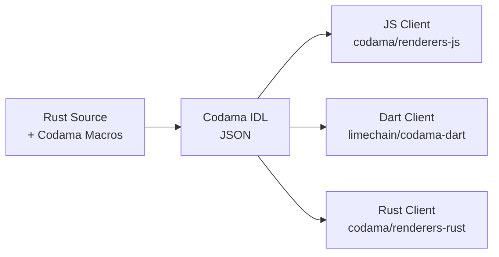

# Sentinel Wallet — Technical Architecture

> **Version**: 0.1.0-draft  
> **Last Updated**: 2025-01  
> **Status**: Active Development  
> **Authors**: meteora-sage team

---

## Table of Contents

1. [Executive Summary](#executive-summary)
2. [System Architecture](#system-architecture)
3. [On-Chain Program Design](#on-chain-program-design)
4. [Account Model](#account-model)
5. [Instruction Set](#instruction-set)
6. [Security Architecture](#security-architecture)
7. [SDK Architecture](#sdk-architecture)
8. [Cryptographic Core](#cryptographic-core)
9. [Transaction Flow](#transaction-flow)
10. [Technology Stack](#technology-stack)
11. [Deployment Strategy](#deployment-strategy)
12. [IDL & Client Generation](#idl--client-generation)
13. [Testing Strategy](#testing-strategy)
14. [Comparison with Existing Solutions](#comparison-with-existing-solutions)

---

## Executive Summary

Sentinel is a **smart wallet program for Solana** that enables AI agents to autonomously execute transactions within owner-defined security boundaries. It solves the fundamental tension in agentic crypto: agents need signing access, but users must retain control.

**Core innovation**: On-chain policy enforcement via session keys with hierarchical scoping — agents never hold the wallet's signing authority. Instead, they use time-bounded, amount-capped session keys that can only call pre-approved programs and instructions.

### Design Goals

| Goal | Approach |
|------|----------|
| Low deploy cost | Pinocchio (not Anchor) → ~10x smaller binary |
| Agent autonomy | Session keys with CPI execution |
| User safety | 4-layer security model, on-chain policy enforcement |
| SDK flexibility | Dart (Flutter), TypeScript, Rust clients |
| Recovery | Guardian-based key rotation |
| Extensibility | Scoped program/instruction allowlists |

---

## System Architecture



### Layer Breakdown

| Layer | Component | Language | Purpose |
|-------|-----------|----------|---------|
| On-Chain | `sentinel-wallet` | Rust (Pinocchio) | Smart wallet program — all policy enforcement |
| Core | `sentinel-core` | Rust | Key management, signing, encryption, policy checks |
| Bridge | `flutter_rust_bridge` | Rust → Dart | Auto-generated FFI bindings |
| SDK | `sentinel-dart` | Dart | Flutter client SDK |
| SDK | `sentinel-ts` | TypeScript | Web/Node.js client SDK |
| Client | Sage / agents | Dart/TS | End-user applications |

---

## On-Chain Program Design

### Why Pinocchio, Not Anchor

| Factor | Pinocchio | Anchor |
|--------|-----------|--------|
| Binary size | ~5-15 KB | ~100-200 KB |
| Deploy cost (SOL) | ~0.05 SOL | ~0.5-2 SOL |
| CU consumption | Minimal overhead | Framework overhead |
| Dependencies | Zero (no_std) | anchor-lang + deps |
| IDL generation | Via Codama (separate) | Built-in |
| Learning curve | Higher | Lower |
| Audit surface | Smaller (less code) | Larger |

**Decision**: For a security-critical financial program, smaller binary = smaller attack surface = lower deploy cost = easier mainnet iteration.

### Program Structure

```
programs/sentinel-wallet/
├── Cargo.toml
└── src/
    ├── lib.rs              # Module declarations, program ID
    ├── entrypoint.rs       # Pinocchio entrypoint! macro
    ├── processor.rs        # Instruction dispatcher (10 variants)
    ├── error.rs            # Custom error types (8 categories)
    ├── state/
    │   ├── mod.rs          # Discriminators, PDA seeds, constants
    │   ├── smart_wallet.rs # SmartWallet account state
    │   ├── session_key.rs  # SessionKey account state
    │   └── agent_config.rs # AgentConfig account state
    └── instructions/
        ├── mod.rs
        ├── create_wallet.rs
        ├── register_agent.rs
        ├── create_session.rs
        ├── execute_via_session.rs  # Core: agent CPI execution
        ├── revoke_session.rs
        ├── update_spending_limit.rs
        ├── add_guardian.rs
        ├── recover_wallet.rs
        ├── deregister_agent.rs
        └── close_wallet.rs
```

### Entrypoint

Using Pinocchio's lightweight `entrypoint!` macro instead of Anchor's framework:

```rust
use pinocchio::entrypoint;
use crate::processor::process_instruction;

entrypoint!(process_instruction);
```

The processor dispatches by reading the first byte of instruction data as a discriminator:

```rust
pub fn process_instruction(
    program_id: &Address,
    accounts: &[AccountView],
    instruction_data: &[u8],
) -> ProgramResult {
    let (discriminator, data) = instruction_data
        .split_first()
        .ok_or(ProgramError::InvalidInstructionData)?;

    match SentinelInstruction::try_from(*discriminator)? {
        SentinelInstruction::CreateWallet => instructions::create_wallet::process(program_id, accounts, data),
        SentinelInstruction::RegisterAgent => instructions::register_agent::process(program_id, accounts, data),
        // ... etc
    }
}
```

---

## Account Model



### PDA Derivation

All accounts are **Program Derived Addresses** (PDAs) — no external keypairs needed:

| Account | Seeds | Reasoning |
|---------|-------|-----------|
| SmartWallet | `["sentinel", owner_pubkey]` | One wallet per owner |
| AgentConfig | `["agent", wallet_pubkey, agent_pubkey]` | Unique per wallet-agent pair |
| SessionKey | `["session", wallet_pubkey, agent_pubkey, session_pubkey]` | Unique per session |

### Account Sizes

| Account | Size (bytes) | Estimated Rent (SOL) |
|---------|-------------|---------------------|
| SmartWallet | ~370 | ~0.003 |
| AgentConfig | ~722 | ~0.006 |
| SessionKey | ~218 | ~0.002 |

### Discriminators

8-byte discriminators for account type identification (not Anchor hashes — readable ASCII):

```
SmartWallet: "SentWalt" (0x53656e7457616c74)
SessionKey:  "SentSess" (0x53656e7453657373)
AgentConfig: "SentAgnt" (0x53656e7441676e74)
```

---

## Instruction Set

| # | Instruction | Signer | Description |
|---|-------------|--------|-------------|
| 0 | `CreateWallet` | Owner | Initialize a SmartWallet PDA with spending limits |
| 1 | `RegisterAgent` | Owner | Register an agent with scoped permissions |
| 2 | `CreateSession` | Agent | Create a time-bounded session key |
| 3 | `ExecuteViaSession` | Session Key | **Core**: Execute CPI via session with policy enforcement |
| 4 | `RevokeSession` | Owner/Agent | Revoke an active session |
| 5 | `UpdateSpendingLimit` | Owner | Modify wallet spending caps |
| 6 | `AddGuardian` | Owner | Add a recovery guardian |
| 7 | `RecoverWallet` | Guardian | Rotate owner key (recovery) |
| 8 | `DeregisterAgent` | Owner | Remove an agent, close its account |
| 9 | `CloseWallet` | Owner | Permanently close the wallet |

### ExecuteViaSession — The Core Instruction

This is the most critical instruction — it's how agents autonomously transact:



**Validation chain** (all must pass, in order):

1. **Session key is signer** — `accounts[0].is_signer()`
2. **Session not expired** — `current_clock < session.expires_at`
3. **Session not revoked** — `!session.is_revoked`
4. **Session spending check** — `session.amount_spent + amount <= session.max_amount`
5. **Session per-tx check** — `amount <= session.max_per_tx`
6. **Agent is active** — `agent.is_active`
7. **Program in allowlist** — target program ID in `agent.allowed_programs`
8. **Instruction in allowlist** — instruction discriminator in `agent.allowed_instructions`
9. **Wallet not locked** — `!wallet.is_locked`
10. **Wallet daily limit** — `wallet.spent_today + amount <= wallet.daily_limit`
11. **Wallet per-tx limit** — `amount <= wallet.per_tx_limit`
12. **Nonce validation** — replay protection

---

## Security Architecture



### 4-Layer Security Model

#### Layer 1: Session Keys (First Contact)

- **Ephemeral**: Generated per-session, not stored long-term
- **Time-bounded**: Configurable expiry (minutes to hours, never days)
- **Amount-capped**: Total session spend and per-TX limits
- **Revocable**: Owner or agent can revoke at any time

#### Layer 2: Agent Scoping (Business Logic)

- **Program Allowlist**: Up to 8 whitelisted program IDs per agent
- **Instruction Allowlist**: Up to 16 whitelisted instruction discriminators
- **Agent Limits**: Separate daily + per-TX limits per agent
- **Active/Inactive Toggle**: Owner can disable agent without destroying config

#### Layer 3: Wallet Policy (Global Caps)

- **Daily Spending Cap**: Automatic reset via timestamp tracking
- **Per-Transaction Cap**: Hard limit on any single operation
- **Nonce**: Replay attack prevention
- **Lock**: Emergency freeze (no transactions until unlocked)

#### Layer 4: Recovery (Last Resort)

- **Guardian System**: Up to 5 trusted guardians
- **Key Rotation**: Guardians can rotate the owner key
- **Social Recovery**: Future: m-of-n threshold approval

### Threat Model

| Threat | Mitigation |
|--------|-----------|
| Agent key compromised | Session keys are time/amount-bounded, revocable |
| Agent gone rogue | Program allowlist prevents accessing unscoped programs |
| Replay attacks | Per-session nonce, incrementing on each execution |
| Owner key compromised | Guardian recovery + emergency lock |
| Program upgrade attack | All policy enforcement is on-chain, not client-side |
| Flash loan manipulation | Daily spending limits cap total exposure |
| Overspending | 3 layers of limits: session → agent → wallet |

---

## SDK Architecture

### sentinel-dart (Flutter SDK)

```
sdk/sentinel-dart/
├── pubspec.yaml
├── lib/
│   ├── sentinel_dart.dart       # Library exports
│   └── src/
│       ├── client.dart           # SentinelClient (main entry)
│       ├── models/               # Dart mirrors of on-chain state
│       │   ├── wallet_state.dart
│       │   ├── agent_config.dart
│       │   └── session_key.dart
│       ├── wallet/               # Wallet management
│       ├── agent/                # Agent management
│       ├── session/              # Session lifecycle
│       └── core/
│           └── rust_bridge.dart  # flutter_rust_bridge FFI
```

**Key integration**: `flutter_rust_bridge` v2.11 auto-generates Dart bindings from `sentinel-core` Rust code. This means:

- Ed25519 signing happens in Rust (fast, auditable)
- Key encryption happens in Rust (no Dart crypto needed)
- Policy checks run natively (Rust speed)
- Dart handles UI + RPC communication

### sentinel-ts (TypeScript SDK)

```
sdk/sentinel-ts/
├── package.json
├── tsconfig.json
└── src/
    ├── index.ts           # Exports
    ├── client.ts          # SentinelClient
    ├── types.ts           # Type definitions
    └── instructions.ts    # Instruction builders
```

Uses `@solana/web3.js` v2 (the new Solana Kit). Instruction builders will be auto-generated by Codama.

---

## Cryptographic Core

### sentinel-core

The Rust core handles all cryptographic operations. It's compiled:

1. **To BPF** → On-chain program (only borsh serialization used)
2. **To native** → via `flutter_rust_bridge` → Dart FFI
3. **As a library** → For Rust-native consumers

```
crates/sentinel-core/
├── Cargo.toml
└── src/
    ├── lib.rs        # Module declarations
    ├── crypto.rs     # Ed25519, AES-256-GCM, PBKDF2
    ├── keyvault.rs   # Encrypted key storage
    ├── signer.rs     # Transaction signing
    ├── policy.rs     # Client-side policy pre-checks
    └── types.rs      # Shared types
```

### Key Management Flow



### Algorithms

| Purpose | Algorithm | Key Size | Library |
|---------|-----------|----------|---------|
| Signing | Ed25519 | 256-bit | ed25519-dalek 2.1 |
| Encryption at rest | AES-256-GCM | 256-bit | aes-gcm 0.10 |
| Key derivation | PBKDF2-HMAC-SHA256 | 256-bit | pbkdf2 0.12 |
| Hashing | SHA-256 | 256-bit | sha2 0.10 |

---

## Transaction Flow

### Happy Path: Agent Executes a Swap



### Error Path: Limit Exceeded



---

## Technology Stack

### Verified Versions (as of 2025-01)

| Component | Version | Source |
|-----------|---------|--------|
| Pinocchio | 0.10.2 | [anza-xyz/pinocchio](https://github.com/anza-xyz/pinocchio) |
| pinocchio-system | 0.5.0 | CPI helper for System Program |
| pinocchio-token | 0.5.0 | CPI helper for SPL Token |
| flutter_rust_bridge | 2.11 | [Flutter Favorite, 4.5M+ downloads](https://pub.dev/packages/flutter_rust_bridge) |
| Codama | 1.5.1 | [codama-idl/codama](https://github.com/codama-idl/codama) |
| codama-dart | latest | [@limechain/codama-dart](https://github.com/codama-idl/codama) |
| borsh | 1.5 | Serialization |
| bytemuck | 1.21 | Zero-copy helpers |
| ed25519-dalek | 2.1 | Ed25519 signing |
| aes-gcm | 0.10 | Key encryption |
| solana-sdk | 2.2 | Client-side Solana |
| Rust | 1.85.0 | Edition 2024 |

### Build Optimization

```toml
[profile.release]
opt-level = "z"      # Optimize for size (critical for deploy cost)
lto = "fat"          # Link-time optimization
codegen-units = 1    # Single codegen unit for better optimization
strip = true         # Strip symbols
overflow-checks = true  # Keep overflow checks (security)
```

---

## Deployment Strategy

### Mainnet Cost Estimation

With Pinocchio's binary size optimization:

| Component | Estimated Size | Deploy Cost |
|-----------|---------------|-------------|
| sentinel-wallet | ~10-20 KB | ~0.05-0.1 SOL |
| Buffer account rent | minimal | ~0.01 SOL |
| **Total** | | **~0.1 SOL** |

Compare to Anchor: ~200 KB → ~1-2 SOL deploy cost.

### Deployment Phases

1. **Localnet**: Local validator testing with LiteSVM/Bankrun
2. **Devnet**: Public testing, SDK integration testing
3. **Mainnet-beta**: Production deployment

---

## IDL & Client Generation

### Codama Pipeline

Since Pinocchio doesn't generate IDLs like Anchor, we use **Codama** (v1.5.1):



Configuration in `codama.json`:

```json
{
  "program": {
    "name": "sentinel_wallet",
    "version": "0.1.0",
    "publicKey": "SentWaL1et111111111111111111111111111111111"
  },
  "renderers": {
    "js":   { "output": "sdk/sentinel-ts/src/generated" },
    "dart": { "output": "sdk/sentinel-dart/lib/src/generated" },
    "rust": { "output": "crates/sentinel-generated" }
  }
}
```

---

## Testing Strategy

### Test Layers

| Layer | Tool | What it Tests |
|-------|------|--------------|
| Unit | `cargo test` | State serialization, error codes, policy logic |
| Integration | solana-bankrun | Full instruction flow, PDA creation, CPI |
| SDK | vitest / dart test | Client-side builders, type conversions |
| E2E | Devnet scripts | Real network deployment and interaction |

### Critical Test Cases

1. **Session key cannot exceed limits** — the most important test
2. **Expired session cannot execute** — time boundary enforcement
3. **Unscoped program rejected** — allowlist enforcement
4. **Daily limit resets correctly** — timestamp-based reset logic
5. **Guardian can recover but not steal** — recovery only rotates keys
6. **Nonce prevents replay** — same TX cannot execute twice
7. **Locked wallet blocks all operations** — emergency freeze
8. **Closed wallet is permanently dead** — no resurrection

---

## Comparison with Existing Solutions

| Feature | Sentinel | Squads v4 | Phantom Embedded | Turnkey |
|---------|----------|-----------|-----------------|---------|
| Framework | Pinocchio | Anchor | Off-chain | Off-chain |
| Deploy size | ~15 KB | ~200 KB | N/A | N/A |
| Agent support | Native (session keys) | Via multisig | Delegated signing | Server infra |
| Policy enforcement | On-chain | On-chain | Client-side | Server-side |
| SDK: Dart | Yes | No | Limited | No |
| SDK: TypeScript | Yes | Yes | Yes | Yes |
| Open source | Apache-2.0 | AGPL-3.0 | Closed | Partial |
| Recovery | Guardian rotation | Multisig | Provider-held | Provider-held |
| Cost to deploy | ~0.1 SOL | ~2 SOL | Free (SaaS) | Paid (SaaS) |
| Self-sovereign | Yes | Yes | No (provider dep) | No (provider dep) |

### Key Differentiators

1. **Pinocchio-native**: Only smart wallet built on Pinocchio — smallest binary, lowest deploy cost
2. **Dart-first SDK**: Only solution with first-class Flutter/Dart support
3. **Agent-native**: Session keys designed specifically for AI agent autonomy
4. **On-chain policy**: All policy enforcement happens on-chain — no trust in client/server
5. **Self-sovereign**: No dependency on any provider — pure on-chain program
