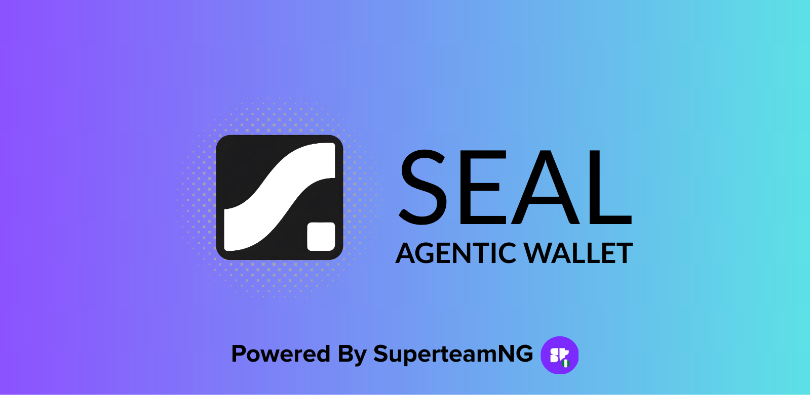
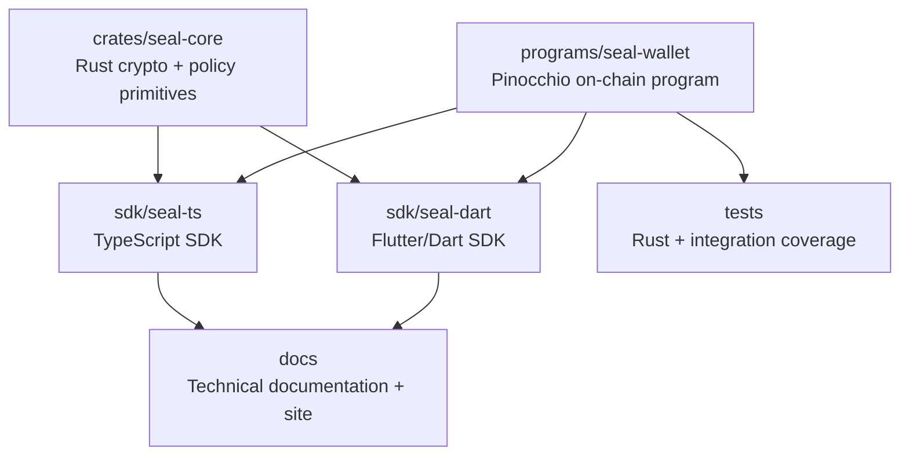

<p align="center">
  
</p>

<p align="center">
  <strong>On-chain autonomous wallet infrastructure for Solana.</strong>
</p>

<p align="center">
  <a href="https://github.com/immadominion/seal/blob/main/LICENSE"></a>
  <a href="https://explorer.solana.com/address/EV3TKRVz7pTHpAqBTjP8jmwuvoRBRCpjmVSPHhcMnXqb?cluster=devnet"></a>
</p>

Seal is an open-source smart wallet SDK with **on-chain policy enforcement** — session keys, spending limits, scoped agent delegation, and guardian recovery — built with [Pinocchio](https://github.com/anza-xyz/pinocchio) for minimal deploy cost and maximum compute efficiency.

## Demo

[](https://youtu.be/bgC_f6LuOlc)

> **Watch**: An AI agent (via OpenClaw) transfers SOL from a Seal wallet, authorized by a session key created in Sigil. No seed phrases, no raw keypairs — just a pairing token.

## Sigil — Agent Wallet Management App

**[sigil.scrolls.fun](https://sigil.scrolls.fun)**

Seal gives you the on-chain program. But how does the agent actually get a wallet?

**Sigil** is the companion mobile app that makes it as easy as creating a Telegram bot:

1. Open Sigil, connect your wallet
2. Tap "New Agent" — set daily limit, per-tx cap, allowed programs
3. Get a **pairing token** (`sgil_xxx`)
4. Hand the token to your AI agent — done

The agent calls `new SigilAgent({ pairingToken })` and it has full wallet access, scoped by the limits you set. You see every transaction in your activity feed. You can lock the wallet, revoke sessions, or withdraw funds from your phone at any time.

```
Skill file ➩ Pairing token ➩ Agent gets full wallet control from anywhere
```

## Why Seal?

| Problem | Existing Solutions | Seal |
|---|---|---|
| AI agents need to sign transactions automatically | Raw keypair in memory (SendAI Agent Kit) — no guardrails | On-chain session keys with scope + expiry + spending limits |
| Wallet providers are vendor-locked | Phantom KMS, Crossmint API, Privy MPC — keys in their servers | Self-custodial, keys encrypted locally, program is open-source |
| Policy enforcement is server-side | Turnkey/Crossmint policies run on their servers — bypassable | On-chain enforcement by Solana runtime — impossible to bypass |
| No Flutter SDK for autonomous wallets | None of them have Flutter support | Native Dart SDK via `flutter_rust_bridge` + Codama |
| Signing costs money | Custodial providers charge per-signature or per-wallet fees | Zero per-signature cost |

## Architecture



## Quick Start

```bash
# Build the on-chain program
cd programs/seal-wallet
cargo build-sbf

# Run tests
cargo test

# Deploy to devnet
solana program deploy target/deploy/seal_wallet.so --url devnet
```

## Key Concepts

### Smart Wallet (PDA)

A program-derived account that holds your assets. Owned by the Seal program, controlled by your master key.

### Session Keys

Ephemeral keypairs with scoped permissions: which programs to call, which instructions, how much to spend, when they expire. Agents use these to sign autonomously.

### Agent Delegation

Register AI agents with specific scopes — e.g., "LP Bot can only call Meteora DLMM, max 5 SOL/day." The on-chain program enforces these limits.

### Guardian Recovery

Set m-of-n guardians who can rotate your master key if you lose access.

## Tech Stack

| Layer | Technology | Why |
|---|---|---|
| On-chain program | [Pinocchio](https://github.com/anza-xyz/pinocchio) v0.10 | Zero-dep, ~10x smaller binary than Anchor, lower deploy cost |
| IDL & client gen | [Codama](https://github.com/codama-idl/codama) | Multi-language client generation (JS, Rust, Dart) |
| Rust core | `ed25519-dalek`, `aes-gcm` | Battle-tested cryptographic primitives |
| Dart FFI | [flutter_rust_bridge](https://cjycode.com/flutter_rust_bridge/) v2 | Flutter Favorite, auto binding generation |
| Testing | [LiteSVM](https://github.com/LiteSVM/litesvm) / Bankrun | Fast local Solana VM for testing |

## License

Apache-2.0
