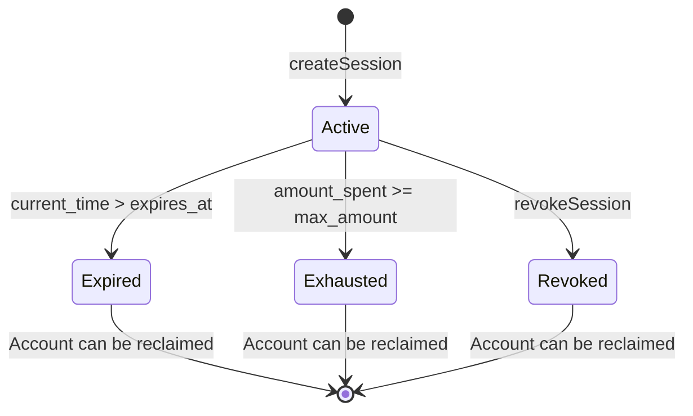

# Account Model

Seal uses three on-chain account types, all stored as PDAs with deterministic derivation. Every account uses Borsh serialization with a fixed-size layout — no variable-length fields, no reallocations.

## SmartWallet

The root account that holds assets and enforces global spending policy.

**PDA Seeds**: `["seal", owner_pubkey]`
**Discriminator**: `SealWalt` (8 bytes)
**Size**: 278 bytes

### Layout

| Offset | Size | Field | Type | Description |
|--------|------|-------|------|-------------|
| 0 | 8 | `discriminator` | `[u8; 8]` | Account type identifier (`SealWalt`) |
| 8 | 32 | `pda_authority` | `Pubkey` | Immutable PDA authority — set once at creation, never changes (CPI signer seeds) |
| 40 | 32 | `owner` | `Pubkey` | Master authority — can be rotated via guardian recovery |
| 72 | 1 | `bump` | `u8` | PDA bump seed |
| 73 | 8 | `nonce` | `u64` | Replay protection counter, incremented per tx |
| 81 | 1 | `agent_count` | `u8` | Number of registered agents |
| 82 | 1 | `guardian_count` | `u8` | Number of guardians (max 5) |
| 83 | 1 | `recovery_threshold` | `u8` | M-of-n guardian recovery threshold |
| 84 | 160 | `guardians` | `[Pubkey; 5]` | Guardian pubkeys (padded to `MAX_GUARDIANS`) |
| 244 | 8 | `daily_limit_lamports` | `u64` | Max lamports any agent can spend in 24h |
| 252 | 8 | `per_tx_limit_lamports` | `u64` | Max lamports per single transaction |
| 260 | 8 | `spent_today_lamports` | `u64` | Rolling daily spend counter |
| 268 | 8 | `day_start_timestamp` | `i64` | Unix timestamp of current spending day |
| 276 | 1 | `is_locked` | `bool` | Emergency lock flag — blocks all agent operations |
| 277 | 1 | `is_closed` | `bool` | Permanently closed — cannot be reopened |

### Key Behaviors

- **Immutable PDA authority**: The `pda_authority` is set to the initial owner at wallet creation and never changes — even after guardian recovery. This ensures CPI signer seeds remain stable through owner rotations.
- **Daily limit reset**: When `current_time - day_start_timestamp ≥ 86400`, the program resets `spent_today_lamports` to 0 and updates `day_start_timestamp`.
- **Emergency lock**: Setting `is_locked = true` immediately blocks all `ExecuteViaSession` calls. Agents cannot transact until the owner unlocks.
- **Nonce**: Incremented on every `ExecuteViaSession` for replay protection. Read this field to track total wallet activity.

## AgentConfig

Configuration for a registered agent — defines exactly what the agent is permitted to do.

**PDA Seeds**: `["agent", wallet_pda, agent_pubkey]`
**Discriminator**: `SealAgnt` (8 bytes)
**Size**: 556 bytes

### Layout

| Offset | Size | Field | Type | Description |
|--------|------|-------|------|-------------|
| 0 | 8 | `discriminator` | `[u8; 8]` | Account type identifier (`SealAgnt`) |
| 8 | 32 | `wallet` | `Pubkey` | Parent SmartWallet PDA |
| 40 | 32 | `agent` | `Pubkey` | The agent's identity pubkey |
| 72 | 64 | `name` | `[u8; 64]` | Human-readable name (UTF-8, zero-padded) |
| 136 | 1 | `bump` | `u8` | PDA bump seed |
| 137 | 1 | `is_active` | `bool` | Whether the agent is currently active |
| 138 | 320 | `allowed_programs` | `[Pubkey; 10]` | Program IDs the agent can CPI into |
| 458 | 1 | `allowed_programs_count` | `u8` | Number of allowed programs (max 10) |
| 459 | 40 | `allowed_instructions` | `[[u8; 8]; 5]` | Instruction discriminators (first 8 bytes) |
| 499 | 1 | `allowed_instructions_count` | `u8` | Number of allowed instruction discriminators (max 5) |
| 500 | 8 | `daily_limit` | `u64` | Max lamports this agent can spend per day |
| 508 | 8 | `per_tx_limit` | `u64` | Max lamports per transaction for this agent |
| 516 | 8 | `default_session_duration` | `i64` | Default session duration in seconds |
| 524 | 8 | `max_session_duration` | `i64` | Maximum session duration in seconds |
| 532 | 8 | `total_spent` | `u64` | Cumulative lamports spent (all-time) |
| 540 | 8 | `tx_count` | `u64` | Cumulative transaction count |
| 548 | 8 | `spent_today` | `u64` | Rolling daily spend counter for this agent |
| 556 | 8 | `day_start_timestamp` | `i64` | Unix timestamp of current spending day |

### Program & Instruction Filtering

The `allowed_programs` and `allowed_instructions` fields act as **allowlists**:

- If `allowed_programs_count = 0`, the agent **cannot call any program** (default-closed)
- If `allowed_programs_count > 0`, the target program must be in the list
- If `allowed_instructions_count = 0`, the agent can call **any instruction** on allowed programs
- If `allowed_instructions_count > 0`, the instruction discriminator must match

This lets you create narrowly scoped agents. For example, an LP bot that can only call `Meteora DLMM` with `addLiquidity` and `removeLiquidity` instruction discriminators.

### Cross-Level Validation

When registering an agent, the program validates that agent limits do not exceed wallet limits:

- `agent.daily_limit ≤ wallet.daily_limit`
- `agent.per_tx_limit ≤ wallet.per_tx_limit`

## SessionKey

An ephemeral key with time and amount bounds for autonomous agent operation.

**PDA Seeds**: `["session", wallet_pda, agent_pubkey, session_pubkey]`
**Discriminator**: `SealSess` (8 bytes)
**Size**: 154 bytes

### Layout

| Offset | Size | Field | Type | Description |
|--------|------|-------|------|-------------|
| 0 | 8 | `discriminator` | `[u8; 8]` | Account type identifier (`SentSess`) |
| 8 | 32 | `wallet` | `Pubkey` | Parent SmartWallet PDA |
| 40 | 32 | `agent` | `Pubkey` | Parent agent pubkey |
| 72 | 32 | `session_pubkey` | `Pubkey` | The ephemeral session key (signs transactions) |
| 104 | 1 | `bump` | `u8` | PDA bump seed |
| 105 | 8 | `created_at` | `i64` | Unix timestamp when session was created |
| 113 | 8 | `expires_at` | `i64` | Unix timestamp when session expires |
| 121 | 8 | `max_amount` | `u64` | Maximum total lamports for this session |
| 129 | 8 | `amount_spent` | `u64` | Lamports already spent |
| 137 | 8 | `max_per_tx` | `u64` | Maximum lamports per individual transaction |
| 145 | 1 | `is_revoked` | `bool` | Whether the session has been revoked |
| 146 | 8 | `nonce` | `u64` | Session nonce for uniqueness |

### Lifecycle

A session key becomes unusable when **any** of these conditions is true:

- `current_time > expires_at` (expired)
- `amount_spent + requested_amount > max_amount` (exhausted)
- `is_revoked == true` (manually revoked)

## Account Size Summary

| Account | Size (bytes) | Rent-Exempt (SOL) | Key |
|---------|-------------|-------------------|-----|
| SmartWallet | 278 | ~0.0031 | `["seal", owner]` |
| AgentConfig | 556 | ~0.0050 | `["agent", wallet, agent]` |
| SessionKey | 154 | ~0.0021 | `["session", wallet, agent, session]` |

All accounts use fixed-size layouts — there are no reallocations or dynamic resizing. This simplifies auditing and ensures deterministic rent costs.
