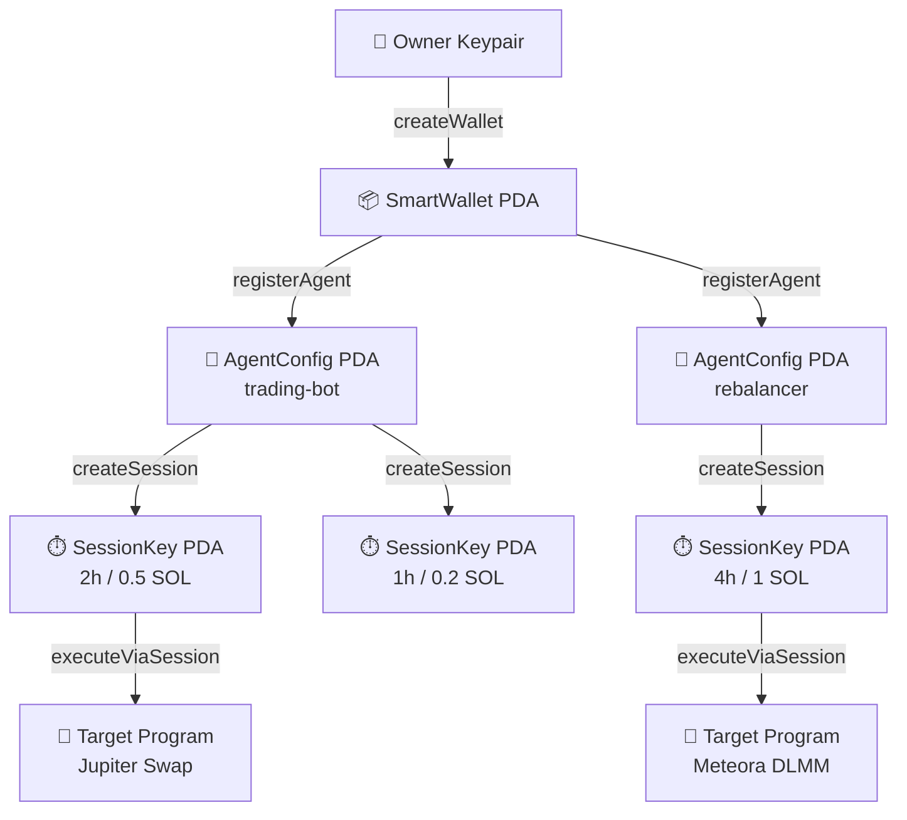
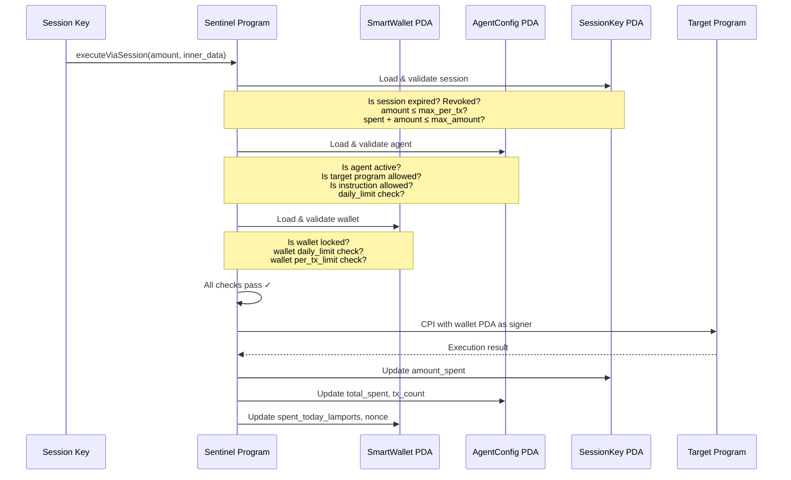
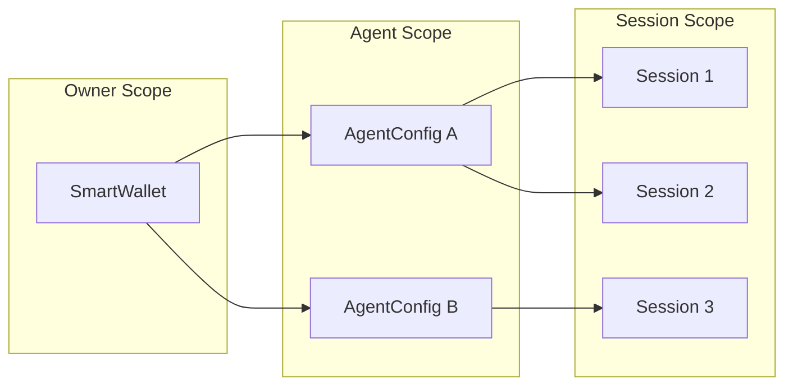

# Architecture

Sentinel is structured as a single Solana program with three on-chain account types that form a hierarchical delegation model. Understanding this hierarchy is key to reasoning about how Sentinel enforces policy.

## Account Hierarchy



### Layers

| Layer | Account | Who Controls | What It Does |
|-------|---------|-------------|--------------|
| **1** | SmartWallet | Owner keypair | Holds assets, sets global limits, manages guardians |
| **2** | AgentConfig | Owner (register/deregister) | Scopes an agent to specific programs, instructions, amounts |
| **3** | SessionKey | Agent (create/revoke) | Ephemeral key with time + amount bounds for autonomous operation |

Each layer narrows the scope of the layer above. A session key can never exceed its agent's limits, and an agent can never exceed the wallet's limits.

## Instruction Flow

When an agent wants to execute a transaction autonomously, the flow passes through every security layer:



Every check is performed **inside the program** before CPI execution. If any check fails, the entire transaction reverts atomically.

## Program Design

### Pinocchio Runtime

Sentinel is built with [Pinocchio](https://github.com/anza-xyz/pinocchio), a zero-copy Solana runtime framework. Unlike Anchor, Pinocchio doesn't generate IDL boilerplate or framework overhead:

| Metric | Sentinel (Pinocchio) | Typical Anchor Program |
|--------|---------------------|----------------------|
| Binary size | ~100 KB | ~500 KB+ |
| Account deserialization | Zero-copy borsh | Framework-managed |
| Instruction dispatch | Manual discriminant byte | Auto-generated |
| CPI signing | Direct PDA seeds | Framework wrapper |

The trade-off is more manual code, but the result is a smaller, more auditable program.

### Instruction Set

Sentinel exposes 10 instructions via a single-byte discriminant:

| Discriminant | Instruction | Authority | Purpose |
|-------------|-------------|-----------|---------|
| `0` | `CreateWallet` | Payer / Owner | Deploy a new SmartWallet PDA |
| `1` | `RegisterAgent` | Owner | Register an agent with scoped permissions |
| `2` | `CreateSessionKey` | Agent | Create an ephemeral session key |
| `3` | `ExecuteViaSession` | Session Key | Execute a CPI through the wallet |
| `4` | `RevokeSession` | Owner / Agent | Revoke a session key immediately |
| `5` | `UpdateSpendingLimit` | Owner | Modify wallet spending limits |
| `6` | `AddGuardian` | Owner | Add a guardian for wallet recovery |
| `7` | `RecoverWallet` | Guardians | Rotate the wallet owner via guardian vote |
| `8` | `DeregisterAgent` | Owner | Remove an agent from the wallet |
| `9` | `CloseWallet` | Owner | Permanently close the wallet |

### PDA Derivation

All accounts are PDAs derived from deterministic seeds:

```
SmartWallet:  ["sentinel", owner_pubkey]
AgentConfig:  ["agent", wallet_pda, agent_pubkey]
SessionKey:   ["session", wallet_pda, agent_pubkey, session_pubkey]
```

This means you can compute any account address client-side without querying the chain. See [PDA Derivation](/api/pda-derivation) for the full derivation logic.

## Security Boundaries



**Key invariant**: permissions only narrow as you move down the hierarchy. A session key cannot grant broader access than its parent agent, and an agent cannot exceed the wallet's global limits. This is enforced at the program level — there's no way to bypass it, even with a malicious client.

## Comparison with Alternatives

| Feature | Sentinel | Squads v4 | Privy | Crossmint |
|---------|----------|-----------|-------|-----------|
| Enforcement | On-chain program | On-chain multisig | Server-side | Server-side |
| Per-sig cost | $0 (tx fee only) | $0 (tx fee only) | $0.01/sig | $0.05/MAW |
| Session keys | ☑ Time + amount bounded | ☒ | ☒ (MPC based) | ☒ |
| Agent isolation | ☑ Per-agent PDA | ☒ | ☒ | ☒ |
| Self-custodial | ☑ PDA from owner key | ☑ | ☒ | ☒ |
| Guardian recovery | ☑ | ☑ (multisig) | ☒ | ☒ |
| Open source | ☑ Apache-2.0 | ☑ | ☒ | Partial |
| Binary size | ~100 KB | ~300 KB | N/A | N/A |
