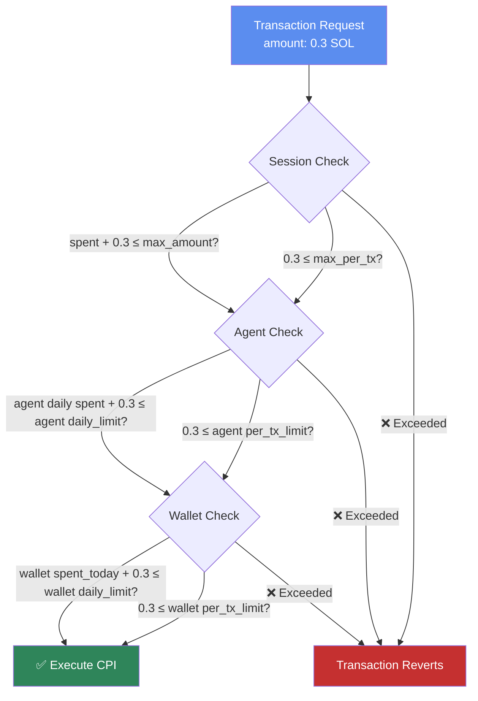
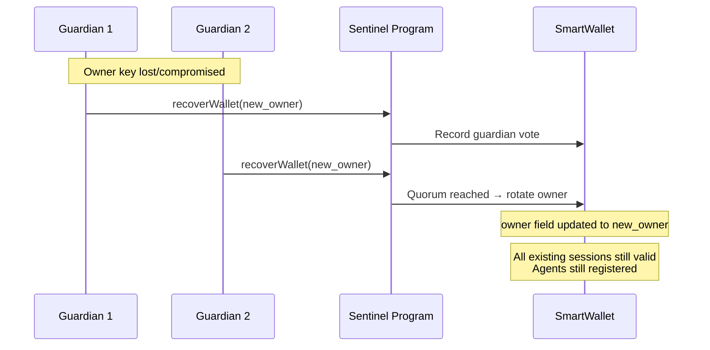

# Security Model

Sentinel's security model is designed around one principle: **the Solana runtime is the only enforcer**. There's no backend server, no admin key, no middleware that can override policy. Every spending limit, every program allowlist, every session expiry is validated inside the program before any CPI executes.

## Threat Model

### What Sentinel Protects Against

| Threat | How Sentinel Handles It |
|--------|------------------------|
| Agent key compromise | Bounded by agent daily/per-tx limits and program allowlist. Revoke the agent. |
| Session key steal | Session is time-bounded and amount-capped. Worst case: the session's remaining budget. |
| Malicious CPI target | Agent's `allowed_programs` list blocks calls to unapproved programs. |
| Replay attack | Wallet nonce incremented per `ExecuteViaSession`. Can't replay same tx. |
| Owner key loss | Guardian recovery rotates the owner pubkey. Funds are not lost. |
| Excessive spending | Three-layer limits: per-tx → agent daily → wallet daily. Each checked independently. |
| Time-of-check/time-of-use | All state mutations happen atomically within a single Solana transaction. |

### What Sentinel Does NOT Protect Against

- **Solana runtime bugs** — Sentinel trusts the Solana VM. If the runtime has a vulnerability, all programs are affected.
- **Price oracle manipulation** — Sentinel enforces lamport-denominated limits, not USD-denominated. A flash-loan attack on a DeFi protocol can still cause losses within the spending cap.
- **Logic bugs in target programs** — If your agent calls a buggy DeFi protocol, Sentinel can't prevent the protocol from misbehaving. It only validates that the call is within scope.

## Three-Layer Limit Enforcement

Every `ExecuteViaSession` call must pass through three independent limit checks:



### Example

Consider a wallet with these limits:

```
Wallet:  daily_limit = 10 SOL, per_tx = 2 SOL
Agent:   daily_limit = 5 SOL,  per_tx = 1 SOL
Session: max_amount = 2 SOL,   max_per_tx = 0.5 SOL
```

An `ExecuteViaSession` call for **0.5 SOL** would:

1. ✅ Session: 0.5 ≤ 0.5 (per_tx), 0 + 0.5 ≤ 2 (total)
2. ✅ Agent: 0.5 ≤ 1 (per_tx), 0 + 0.5 ≤ 5 (daily)
3. ✅ Wallet: 0.5 ≤ 2 (per_tx), 0 + 0.5 ≤ 10 (daily)
4. ✅ CPI executes

A call for **1.5 SOL** would:

1. ❌ Session: 1.5 > 0.5 (per_tx limit exceeded)
2. Transaction reverts. No funds move.

## Program Scope Enforcement

Each agent has an explicit allowlist of programs and instruction discriminators:

```typescript
// Only allow this agent to call Meteora DLMM
await client.registerAgent(owner, agentKey, {
  name: "lp-bot",
  allowedPrograms: [METEORA_DLMM_PROGRAM_ID],
  allowedInstructions: [
    Buffer.from([/* addLiquidity discriminator */]),
    Buffer.from([/* removeLiquidity discriminator */]),
  ],
  dailyLimitSol: 5,
  perTxLimitSol: 1,
});
```

When `executeViaSession` runs, the program checks:

1. Is `target_program` in `agent.allowed_programs`? (If the list is non-empty)
2. Is the first 8 bytes of `inner_instruction_data` in `agent.allowed_instructions`? (If the list is non-empty)

If either check fails, the transaction reverts with `ProgramNotAllowed` (error 500) or `InstructionNotAllowed` (error 501).

## Session Key Security

Session keys are the most exposed component — they're the keys that agents actually use to sign. Sentinel minimizes their blast radius:

| Property | How It Helps |
|----------|-------------|
| **Time-bounded** | Sessions expire after a set duration (minutes to hours). A stolen session key has a narrow window. |
| **Amount-capped** | Each session has a total spending cap. Once reached, the session is useless. |
| **Per-tx limit** | Even within the cap, each transaction is bounded. No single tx can drain the session budget. |
| **Revocable** | The owner or the parent agent can revoke a session immediately via `RevokeSession`. |
| **Non-transferable** | Session keys are PDA-bound. They can only be used through the Sentinel program with the correct wallet + agent + session PDA chain. |

### Best Practices

- **Short durations**: Use 1-4 hour sessions for active trading, not 24-hour sessions.
- **Tight caps**: Set `max_amount` to the minimum needed for the task.
- **Rotate frequently**: Create a new session for each operational cycle. The rent cost (~0.002 SOL) is negligible.
- **Revoke on error**: If an agent encounters unexpected conditions, revoke the session before investigating.

## Guardian Recovery

Sentinel supports up to 5 guardians per wallet. Guardians can collectively vote to rotate the wallet owner — useful when the owner key is lost or compromised.



Recovery does **not** affect registered agents or active sessions. The new owner inherits all wallet configuration. This avoids downtime — agents can continue operating through the recovery process.

### Guardian Rules

- Maximum 5 guardians per wallet (`MAX_GUARDIANS = 5`)
- Only the owner can add guardians (`AddGuardian`)
- Guardian pubkeys are stored in fixed-size slots in the SmartWallet account
- Recovery requires guardian consensus (majority vote)

## Error Codes

Sentinel uses structured error codes for precise failure diagnosis:

| Range | Category | Examples |
|-------|----------|---------|
| 0–99 | General | `InvalidInstruction`, `AccountNotSigner`, `InsufficientFunds` |
| 100–199 | Wallet | `WalletAlreadyExists`, `InvalidWalletOwner`, `WalletClosed` |
| 200–299 | Agent | `AgentAlreadyRegistered`, `AgentNotActive`, `MaxAgentsReached` |
| 300–399 | Session | `SessionExpired`, `SessionRevoked`, `SpendingLimitExceeded`, `DailyLimitExceeded` |
| 400–499 | Guardian | `MaxGuardiansReached`, `InsufficientGuardianApprovals` |
| 500–599 | CPI | `ProgramNotAllowed`, `InstructionNotAllowed`, `CpiExecutionFailed` |

See the [full error enum](https://github.com/immadominion/sentinel/blob/main/programs/sentinel-wallet/src/error.rs) for all codes.
