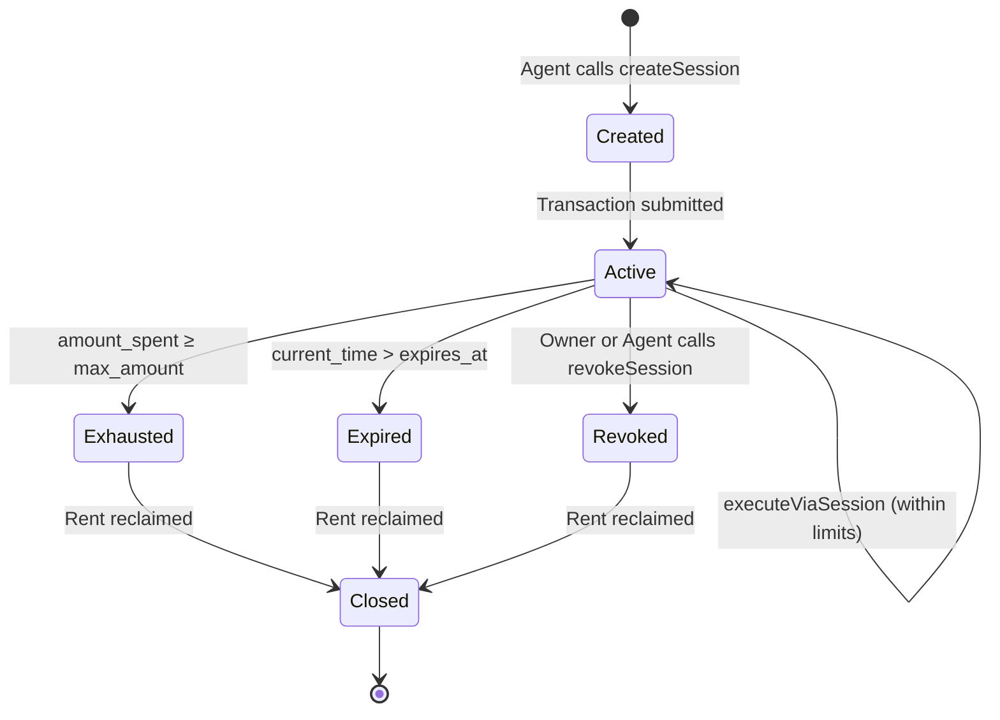

# Session Keys

Session keys are Seal's core mechanism for autonomous agent operation. They're ephemeral keypairs with cryptographically enforced time, amount, and scope boundaries — designed to be created, used, and discarded frequently.

## Why Session Keys?

The fundamental challenge: an AI agent needs to sign transactions, but you don't want to give it your private key. The options are:

| Approach | Problem |
|----------|---------|
| Share the owner key | Total control. One bug drains everything. |
| Server-side relay | Centralized, must be trusted, adds latency. |
| MPC key sharding | Expensive per-signature ($0.01+), complex setup. |
| **Session keys** | **Time-bounded, amount-capped, revocable, zero per-sig cost.** |

Session keys are the best trade-off for high-frequency autonomous agents.

## How They Work

A session key is an ephemeral `Keypair` that exists only in the agent's memory. The agent asks the Seal program to create a `SessionKey` PDA that links the ephemeral key to a specific wallet and agent configuration:

```typescript
import { Keypair, LAMPORTS_PER_SOL } from "@solana/web3.js";
import { SealClient } from "seal-wallet-sdk";

const client = new SealClient({ network: "devnet" });

// Generate an ephemeral keypair (never stored on disk)
const sessionKeypair = Keypair.generate();

// Create the session — agent must sign this tx
const session = await client.createSession(agentKeypair, ownerPubkey, {
  sessionPubkey: sessionKeypair.publicKey,
  durationSecs: BigInt(3600),           // 1 hour
  maxAmountLamports: BigInt(0.5 * LAMPORTS_PER_SOL),  // 0.5 SOL total
  maxPerTxLamports: BigInt(0.1 * LAMPORTS_PER_SOL),   // 0.1 SOL per tx
});
```

Once created, the agent signs transactions with `sessionKeypair` instead of the owner or agent key. The Seal program validates the session before executing any CPI.

## Session Lifecycle



### States

| State | Condition | Can Execute? |
|-------|-----------|-------------|
| **Active** | Not expired, not exhausted, not revoked | ☑ Yes |
| **Expired** | `current_time > expires_at` | ☒ No |
| **Exhausted** | `amount_spent + requested ≥ max_amount` | ☒ No |
| **Revoked** | `is_revoked == true` | ☒ No |

The program checks **all three conditions** on every `ExecuteViaSession` call. Any failing check reverts the transaction atomically.

## Execution with a Session Key

```typescript
import { executeViaSessionInstruction } from "seal-wallet-sdk";

const execIx = executeViaSessionInstruction({
  sessionKeypair,              // The ephemeral key that signs
  walletOwner: ownerPubkey,    // To derive wallet PDA
  agent: agentKeypair.publicKey,
  targetProgram: JUPITER_PROGRAM_ID,
  amountLamports: BigInt(0.05 * LAMPORTS_PER_SOL),
  innerInstructionData: swapInstructionData,
  remainingAccounts: swapAccounts,
});
```

The Seal program then:

1. Loads the `SessionKey` PDA and validates it's active
2. Checks `amount_lamports ≤ session.max_per_tx`
3. Checks `session.amount_spent + amount_lamports ≤ session.max_amount`
4. Loads the `AgentConfig` PDA — validates the target program and instruction are allowed
5. Checks agent daily limit
6. Loads the `SmartWallet` PDA — checks wallet-level limits
7. Executes the CPI with the wallet PDA as signer
8. Updates `amount_spent` on the session, `total_spent` on the agent, and counters on the wallet

## Session Duration Strategy

Choose session duration based on your agent's operational pattern:

| Use Case | Duration | Cap | Rationale |
|----------|----------|-----|-----------|
| **Trading bot** | 1-2 hours | 0.5 SOL | Tight window, rotate sessions frequently |
| **Rebalancer** | 4 hours | 2 SOL | Runs periodically, needs more headroom |
| **Monitoring agent** | 24 hours | 0.01 SOL | Only needs read + occasional small tx |
| **One-shot task** | 5 minutes | exact amount | Execute a single trade, discard immediately |

::: tip
**Prefer short sessions with tight caps.** The rent cost for creating a session is ~0.002 SOL — negligible compared to the security benefit of frequent rotation.
:::

## Session Rotation Pattern

Production agents should rotate sessions automatically:

```typescript
async function withSession(
  client: SealClient,
  agent: Keypair,
  ownerPubkey: PublicKey,
  task: (session: Keypair) => Promise<void>
) {
  const sessionKeypair = Keypair.generate();

  // Create session scoped to this task
  await client.createSession(agent, ownerPubkey, {
    sessionPubkey: sessionKeypair.publicKey,
    durationSecs: BigInt(300),  // 5 minutes
    maxAmountLamports: BigInt(0.1 * LAMPORTS_PER_SOL),
    maxPerTxLamports: BigInt(0.1 * LAMPORTS_PER_SOL),
  });

  try {
    await task(sessionKeypair);
  } finally {
    // Always revoke after use
    await client.revokeSession(agent, ownerPubkey, sessionKeypair.publicKey);
  }
}

// Usage
await withSession(client, agentKeypair, ownerPubkey, async (session) => {
  // Execute one trade with this session
  await executeTrade(session, tradeParams);
});
// Session is revoked, keypair is garbage collected
```

## Revocation

Sessions can be revoked by either the **owner** or the **parent agent**:

```typescript
// Owner revokes (emergency)
await client.revokeSession(ownerKeypair, ownerPubkey, sessionPubkey);

// Agent revokes (routine cleanup)
await client.revokeSession(agentKeypair, ownerPubkey, sessionPubkey);
```

Revocation sets `is_revoked = true` on the `SessionKey` PDA. Any subsequent `ExecuteViaSession` call with this session will fail with error `SessionRevoked` (301).

::: warning
Revocation is **irreversible**. Once revoked, the session cannot be reactivated. Create a new session instead.
:::

## Security Considerations

### Key Storage

Session keypairs should **never** be written to disk or logged. They exist only in memory for the duration of their use:

```typescript
// ☑ Good — keypair lives in memory
const session = Keypair.generate();
await executeWithSession(session);
// session goes out of scope, garbage collected

// ☒ Bad — never do this
fs.writeFileSync("session.json", JSON.stringify(Array.from(session.secretKey)));
```

### Concurrent Sessions

An agent can have multiple active sessions simultaneously. Each session has independent counters and limits. This is useful for agents that need to execute different types of operations in parallel:

```typescript
// Trading session — tight limits
const tradingSession = await client.createSession(agent, owner, {
  durationSecs: BigInt(1800),  // 30 min
  maxAmountLamports: BigInt(0.5 * LAMPORTS_PER_SOL),
  maxPerTxLamports: BigInt(0.1 * LAMPORTS_PER_SOL),
});

// Monitoring session — minimal budget
const monitorSession = await client.createSession(agent, owner, {
  durationSecs: BigInt(86400),  // 24h
  maxAmountLamports: BigInt(0.001 * LAMPORTS_PER_SOL),
  maxPerTxLamports: BigInt(0.001 * LAMPORTS_PER_SOL),
});
```

### Rate Limiting

Seal does not impose transaction rate limits beyond Solana's native throughput. However, the spending counters act as an economic rate limit — once a session's budget is exhausted, it must create a new one.
