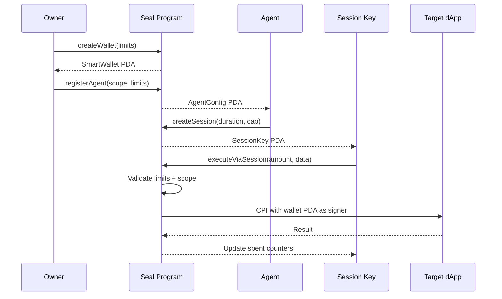

# What is Seal?

Seal is an **on-chain smart wallet program** deployed on Solana that lets AI agents transact autonomously — without ever holding your private key.

It solves a fundamental problem: AI agents need to sign transactions, but you should never hand them your secret key. Seal introduces a PDA-based delegation layer where agents operate under **cryptographically enforced spending limits**, **time-bounded sessions**, and **program-scoped permissions** — all validated by the Solana runtime itself.

## The Problem

Every wallet solution for autonomous agents today picks one of two bad trade-offs:

| Approach | Problem |
|----------|---------|
| **Share the private key** | Agent has full control. One bug drains everything. |
| **Server-side relay** | Centralized chokepoint. Goes down, agents stop. You're trusting the relay. |
| **Custodial wallets** | Not your keys, not your crypto. Provider can freeze funds. |
| **Per-signature billing** | $0.01–$0.05/sig adds up fast for high-frequency agents. |

Seal takes a different path: the **Solana program itself** is the enforcer. No server, no relay, no trust assumptions beyond the blockchain.

## How It Works



1. **Owner** creates a SmartWallet PDA with daily and per-transaction spending limits
2. **Owner** registers an agent — scoped to specific programs, instructions, and amounts
3. **Agent** creates a short-lived session key (hours, not days)
4. **Session key** signs transactions. The Seal program validates every policy before executing the CPI
5. Session expires or gets revoked. Agent creates a new one.

The owner's private key is never exposed to the agent. The worst-case scenario for a compromised session key is the session's spending cap — which might be 0.5 SOL for a 2-hour window.

## Why Seal?

### On-Chain Enforcement

Spending limits, program allowlists, and session expiry are validated **inside the Solana program**. There's no middleware, no API server, no admin key that can override the rules. The runtime is the enforcer.

### Zero Per-Signature Cost

Unlike Privy ($0.01/sig) or Crossmint ($0.05/MAW), Seal charges **nothing** per signature. Once the session key is created, the agent signs directly — no relay, no paywall. You only pay standard Solana transaction fees (~$0.00025).

### Multi-Agent Isolation

Each registered agent gets its own `AgentConfig` PDA with independent spending limits, program scopes, and instruction allowlists. One compromised agent cannot access another agent's session keys or exceed its own limits.

### Self-Custodial

The SmartWallet PDA is derived from your owner pubkey. You — and only you — can register agents, update limits, add guardians, or close the wallet. No third party holds your funds.

### Pinocchio Runtime

Built with [Pinocchio](https://github.com/anza-xyz/pinocchio) instead of Anchor. The program binary is ~100 KB compared to Anchor's ~500 KB+. Lower compute, lower deploy cost, smaller attack surface.

### Guardian Recovery

If the owner key is compromised, guardians can vote to rotate the owner — recovering the wallet without losing funds or freezing operations.

## Program ID

Seal is deployed on **Solana devnet**:

```
EV3TKRVz7pTHpAqBTjP8jmwuvoRBRCpjmVSPHhcMnXqb
```

[View on Solana Explorer →](https://explorer.solana.com/address/EV3TKRVz7pTHpAqBTjP8jmwuvoRBRCpjmVSPHhcMnXqb?cluster=devnet)

## Next Steps

<div class="tip custom-block" style="padding-top: 8px">
Ready to build? Jump to <a href="/guide/installation">Installation</a> to set up the SDK, or read <a href="/concepts/architecture">Architecture</a> for the full technical deep-dive.
</div>
