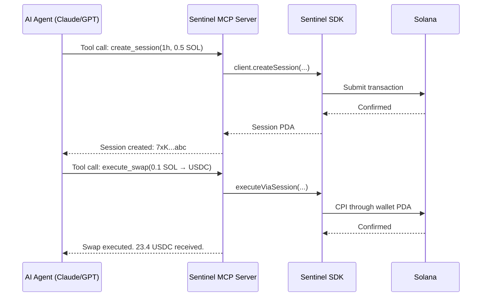

# MCP Server

Sentinel can be exposed as a [Model Context Protocol (MCP)](https://modelcontextprotocol.io/) server, enabling AI agents built with Claude, GPT, or any MCP-compatible LLM to interact with Sentinel wallets through natural language tool calls.

## What is MCP?

MCP is an open protocol that lets AI assistants call external tools. Instead of generating raw transaction bytes, an AI agent declares intent — "swap 0.1 SOL for USDC on Jupiter" — and the MCP server translates that into Sentinel instructions, enforcing all on-chain policies.



## Why MCP + Sentinel?

The combination is uniquely powerful for agentic workflows:

| Without Sentinel | With Sentinel |
|-----------------|---------------|
| AI agent needs the private key | AI agent uses a scoped session key |
| No spending limits | Per-tx and daily limits enforced on-chain |
| One key compromise = total loss | Session compromise = bounded to session cap |
| Manual transaction review | Autonomous operation within policy |

MCP provides the **interface** (natural language → tool calls). Sentinel provides the **security** (on-chain policy enforcement). Together, they enable truly autonomous AI agents that can trade, rebalance, and manage DeFi positions without human intervention — and without holding your keys.

## Tools

A Sentinel MCP server exposes these tools to AI agents:

### Wallet Management

| Tool | Description | Sentinel Instruction |
|------|-------------|---------------------|
| `sentinel_create_wallet` | Create a new smart wallet | `CreateWallet` |
| `sentinel_get_wallet` | Fetch wallet state (balances, limits, status) | Account read |
| `sentinel_update_limits` | Modify spending limits | `UpdateSpendingLimit` |
| `sentinel_close_wallet` | Permanently close a wallet | `CloseWallet` |

### Agent Management

| Tool | Description | Sentinel Instruction |
|------|-------------|---------------------|
| `sentinel_register_agent` | Register a new agent with scoped permissions | `RegisterAgent` |
| `sentinel_get_agent` | Fetch agent config and stats | Account read |
| `sentinel_deregister_agent` | Remove an agent | `DeregisterAgent` |

### Session Management

| Tool | Description | Sentinel Instruction |
|------|-------------|---------------------|
| `sentinel_create_session` | Create a time-bounded session key | `CreateSessionKey` |
| `sentinel_get_session` | Fetch session state (spent, remaining, expiry) | Account read |
| `sentinel_revoke_session` | Revoke a session immediately | `RevokeSession` |

### Execution

| Tool | Description | Sentinel Instruction |
|------|-------------|---------------------|
| `sentinel_execute` | Execute a CPI through the wallet via session key | `ExecuteViaSession` |

### Guardian Recovery

| Tool | Description | Sentinel Instruction |
|------|-------------|---------------------|
| `sentinel_add_guardian` | Add a recovery guardian | `AddGuardian` |
| `sentinel_recover_wallet` | Initiate guardian recovery | `RecoverWallet` |

## Implementation

An MCP server for Sentinel wraps the TypeScript SDK in MCP tool definitions. Here's a minimal implementation:

```typescript
import { McpServer } from "@modelcontextprotocol/sdk/server/mcp.js";
import { StdioServerTransport } from "@modelcontextprotocol/sdk/server/stdio.js";
import { z } from "zod";
import { SentinelClient } from "@sentinel-wallet/sdk";
import { Keypair, LAMPORTS_PER_SOL } from "@solana/web3.js";

const client = new SentinelClient({ network: "devnet" });

const server = new McpServer({
  name: "sentinel-mcp",
  version: "0.1.0",
});

// Tool: Create a wallet
server.tool(
  "sentinel_create_wallet",
  "Create a new Sentinel smart wallet on Solana",
  {
    dailyLimitSol: z.number().describe("Maximum SOL spendable per day"),
    perTxLimitSol: z.number().describe("Maximum SOL per transaction"),
  },
  async ({ dailyLimitSol, perTxLimitSol }) => {
    const owner = loadOwnerKeypair(); // Load from secure storage
    const result = await client.createWallet(owner, {
      dailyLimitSol,
      perTxLimitSol,
    });
    return {
      content: [{
        type: "text",
        text: `Wallet created.\nPDA: ${result.walletPda.toBase58()}\nDaily limit: ${dailyLimitSol} SOL\nPer-tx limit: ${perTxLimitSol} SOL`,
      }],
    };
  }
);

// Tool: Get wallet state
server.tool(
  "sentinel_get_wallet",
  "Fetch the current state of a Sentinel wallet",
  {
    ownerAddress: z.string().describe("Owner's public key (base58)"),
  },
  async ({ ownerAddress }) => {
    const wallet = await client.getWallet(new PublicKey(ownerAddress));
    return {
      content: [{
        type: "text",
        text: JSON.stringify({
          agents: wallet.agentCount,
          dailyLimit: `${Number(wallet.dailyLimitLamports) / LAMPORTS_PER_SOL} SOL`,
          spentToday: `${Number(wallet.spentTodayLamports) / LAMPORTS_PER_SOL} SOL`,
          isLocked: wallet.isLocked,
          guardians: wallet.guardianCount,
        }, null, 2),
      }],
    };
  }
);

// Tool: Create session
server.tool(
  "sentinel_create_session",
  "Create a time-bounded session key for autonomous operation",
  {
    durationMinutes: z.number().describe("Session duration in minutes"),
    maxAmountSol: z.number().describe("Maximum SOL for this session"),
    maxPerTxSol: z.number().describe("Maximum SOL per transaction"),
  },
  async ({ durationMinutes, maxAmountSol, maxPerTxSol }) => {
    const agentKeypair = loadAgentKeypair();
    const sessionKeypair = Keypair.generate();

    const result = await client.createSession(agentKeypair, ownerPubkey, {
      sessionPubkey: sessionKeypair.publicKey,
      durationSecs: BigInt(durationMinutes * 60),
      maxAmountLamports: BigInt(maxAmountSol * LAMPORTS_PER_SOL),
      maxPerTxLamports: BigInt(maxPerTxSol * LAMPORTS_PER_SOL),
    });

    return {
      content: [{
        type: "text",
        text: `Session created.\nPDA: ${result.sessionPda.toBase58()}\nExpires in: ${durationMinutes} min\nBudget: ${maxAmountSol} SOL`,
      }],
    };
  }
);

// Start the server
const transport = new StdioServerTransport();
await server.connect(transport);
```

## Configuration

Add to your MCP client configuration (e.g., Claude Desktop):

```json
{
  "mcpServers": {
    "sentinel": {
      "command": "node",
      "args": ["path/to/sentinel-mcp/dist/index.js"],
      "env": {
        "SOLANA_RPC_URL": "https://api.devnet.solana.com",
        "SENTINEL_OWNER_KEY": "path/to/owner-keypair.json"
      }
    }
  }
}
```

::: danger
The MCP server has access to the agent's keypair. Run it only in trusted environments. The session key mechanism ensures that even if the MCP server is compromised, damage is bounded to the active session's spending cap.
:::

## Agent Workflow Example

Here's how an AI agent might use the MCP tools in a conversation:

> **Agent**: I need to set up a trading bot that can swap on Jupiter with a 2 SOL daily limit.
>
> 1. `sentinel_create_wallet({ dailyLimitSol: 5, perTxLimitSol: 1 })`
> 2. `sentinel_register_agent({ name: "jupiter-trader", dailyLimitSol: 2, perTxLimitSol: 0.5, allowedPrograms: ["JUP6..."] })`
> 3. `sentinel_create_session({ durationMinutes: 60, maxAmountSol: 0.5, maxPerTxSol: 0.1 })`
> 4. `sentinel_execute({ targetProgram: "JUP6...", amount: 0.1, data: "..." })`
>
> The agent operates autonomously within these bounds. When the session expires, it creates a new one.

## Security Considerations

- **Key storage**: The MCP server needs access to agent keypairs. Use environment variables or a secrets manager — never hardcode keys.
- **Session scope**: Create sessions with the minimum duration and amount needed for the current task.
- **Program allowlists**: Register agents with explicit `allowedPrograms` to prevent the AI from calling arbitrary programs.
- **Monitoring**: Query `sentinel_get_session` periodically to track spending and detect anomalous behavior.
