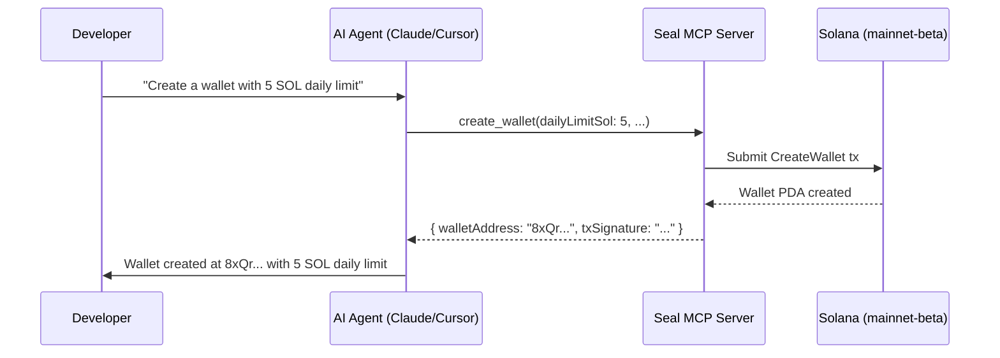

# MCP Integration

Seal provides a [Model Context Protocol (MCP)](https://modelcontextprotocol.io/) server that gives AI agents direct access to **Seal wallet operations**. Any MCP-compatible client — Claude Desktop, Cursor, Windsurf, VS Code Copilot — can create wallets, register agents, manage sessions, and execute transactions through Seal.

## What is MCP?

MCP is an open protocol that lets AI assistants call external tools. The Seal MCP server exposes all wallet operations as tools, so AI agents can autonomously manage smart wallets — creating sessions, executing CPI, and monitoring spending — all within on-chain enforced limits.



## Why Seal MCP?

| Without Seal MCP | With Seal MCP |
|-----------------|---------------|
| Manual wallet management | AI creates wallets, agents, sessions on command |
| Copy-paste keypairs | MCP handles key management per-call |
| Build custom integration code | Ready-to-use tools out of the box |
| No spending guardrails for AI | On-chain limits enforced by Solana runtime |

## Tools (19 operations)

### Wallet Operations

| Tool | Description |
|------|-------------|
| `create_wallet` | Create a new SmartWallet with spending limits |
| `get_wallet` | Fetch wallet on-chain data (limits, guardians, status) |
| `update_spending_limits` | Update daily and per-tx spending limits |
| `add_guardian` | Add a guardian for m-of-n recovery |
| `lock_wallet` | Lock or unlock delegated execution |
| `remove_guardian` | Remove a guardian and clamp threshold if needed |
| `close_wallet` | Permanently close the wallet |

### Agent Operations

| Tool | Description |
|------|-------------|
| `register_agent` | Register an AI agent with scoped permissions |
| `get_agent_config` | Fetch agent configuration and spending stats |
| `deregister_agent` | Remove an agent from the wallet |

### Session Operations

| Tool | Description |
|------|-------------|
| `create_session` | Create an ephemeral session key (time + budget bounded) |
| `get_session` | Fetch session state (spent, remaining, expiry) |
| `revoke_session` | Emergency revoke a session |

### Execution

| Tool | Description |
|------|-------------|
| `execute_via_session` | Execute a CPI through Seal with spending enforcement |

### PDA Derivation (read-only)

| Tool | Description |
|------|-------------|
| `derive_wallet_pda` | Derive wallet PDA from owner pubkey |
| `derive_agent_pda` | Derive agent config PDA |
| `derive_session_pda` | Derive session PDA |

### Recovery

| Tool | Description |
|------|-------------|
| `recover_wallet` | Rotate wallet owner via guardian recovery |
| `set_recovery_threshold` | Configure how many guardians must co-sign recovery |

## Quick Setup

Install and run directly from npm:

```bash
npx seal-wallet-mcp-server
```

### VS Code (GitHub Copilot)

Add to `.vscode/mcp.json` in your project:

```json
{
  "servers": {
    "seal-wallet": {
      "command": "npx",
      "args": ["-y", "seal-wallet-mcp-server"],
      "type": "stdio"
    }
  }
}
```

Restart VS Code and the Seal tools will be available in agent mode.

### Cursor

Add to `~/.cursor/mcp.json`:

```json
{
  "mcpServers": {
    "seal-wallet": {
      "command": "npx",
      "args": ["-y", "seal-wallet-mcp-server"]
    }
  }
}
```

### Claude Desktop

Add to `claude_desktop_config.json`:

```json
{
  "mcpServers": {
    "seal-wallet": {
      "command": "npx",
      "args": ["-y", "seal-wallet-mcp-server"]
    }
  }
}
```

### Local Development

Clone the repo and build:

```bash
git clone https://github.com/immadominion/seal.git
cd seal/packages/mcp-server
npm install
npm run build
```

Then run the built server directly:

```bash
node dist/index.js
```

Or point your MCP client at it:

```json
{
  "seal-wallet": {
    "command": "node",
    "args": ["./seal/packages/mcp-server/dist/index.js"]
  }
}
```

::: tip
The MCP server defaults to **Solana devnet**. All tools accept optional `network` and `rpcUrl` parameters, so you can target a different cluster explicitly.
:::

## Resources

The MCP server also exposes read-only resources:

| Resource | URI | Content |
|----------|-----|---------|
| Program Info | `seal://program-info` | Program ID, features, SDK info |
| Architecture | `seal://architecture` | Account hierarchy, spending model, discriminators |

## Example Usage

```
> Create a Seal wallet with 5 SOL daily limit and 1 SOL per-tx limit

> Register an agent called "lp-bot" scoped to Meteora DLMM only,
  with a 2 SOL daily limit

> Create a 2-hour session for the agent with 0.5 SOL budget

> Show me the wallet status and spending today

> Emergency revoke all sessions for agent "lp-bot"
```

## Security Notes

- **Secret keys are passed per-call** — the MCP server needs keypairs to sign transactions. This is safe when running locally (stdio transport). Never expose the MCP server over a network.
- **On-chain enforcement** — even if the MCP server is compromised, the Solana program enforces all spending limits, program allowlists, and session expiry.
- **No persistent key storage** — the MCP server does not store keys between calls.
