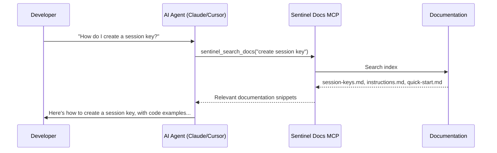
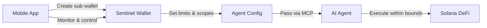

# MCP Integration

Sentinel provides a [Model Context Protocol (MCP)](https://modelcontextprotocol.io/) server that gives AI agents direct access to **Sentinel's documentation**. Any MCP-compatible client — Claude Desktop, Cursor, Windsurf, VS Code Copilot — can search and retrieve Sentinel docs to understand the wallet system and generate correct integration code.

## What is MCP?

MCP is an open protocol that lets AI assistants call external tools. A **docs MCP server** exposes your project's documentation as searchable tools, so AI agents can look up API references, architecture guides, and code examples on-demand — without you copy-pasting into the chat.



## Why a Docs MCP?

| Without Docs MCP | With Docs MCP |
|-----------------|---------------|
| Copy-paste docs into every chat | AI agent fetches what it needs |
| Context window fills up fast | Only relevant sections retrieved |
| Outdated info from training data | Always reads latest docs |
| Agent guesses at API shapes | Agent reads actual type definitions |

This is especially valuable for Sentinel because the on-chain program uses non-standard patterns (Pinocchio, manual account serialization, ASCII discriminators) that LLMs are unlikely to have in their training data.

## Tools

The Sentinel docs MCP server exposes these tools:

| Tool | Description |
|------|-------------|
| `sentinel_search_docs` | Full-text search across all Sentinel documentation |
| `sentinel_get_doc` | Retrieve a specific documentation page by path |
| `sentinel_list_docs` | List all available documentation pages |

### Example Queries

```
sentinel_search_docs("session key spending limits")
→ Returns: session-keys.md (§ Spending Limits), security-model.md (§ Three-Layer Limits)

sentinel_search_docs("PDA derivation agent")
→ Returns: pda-derivation.md (§ Agent Config PDA), constants.md (§ Seeds)

sentinel_get_doc("api/instructions")
→ Returns: Full contents of the Instructions reference page

sentinel_list_docs()
→ Returns: All page paths with titles
```

## Quick Install

<McpInstallButtons 
  title="Add Sentinel to Your AI Assistant"
  description="One-click install for Cursor, VS Code (Copilot), or Claude Desktop. Your AI will have instant access to all Sentinel documentation."
  server-name="sentinel-docs"
  package-name="@sentinel-wallet/mcp-docs"
/>

## Configuration

Add to your MCP client configuration (e.g., Claude Desktop `claude_desktop_config.json`):

```json
{
  "mcpServers": {
    "sentinel-docs": {
      "command": "npx",
      "args": ["-y", "@sentinel-wallet/mcp-docs"]
    }
  }
}
```

For Cursor, add to `.cursor/mcp.json`:

```json
{
  "mcpServers": {
    "sentinel-docs": {
      "command": "npx",
      "args": ["-y", "@sentinel-wallet/mcp-docs"]
    }
  }
}
```

::: tip
The docs MCP server is read-only — it only serves documentation. No keys, no wallet access, no security concerns.
:::

## Implementation

The docs MCP server indexes the VitePress documentation at build time and serves it via stdio transport:

```typescript
import { McpServer } from "@modelcontextprotocol/sdk/server/mcp.js";
import { StdioServerTransport } from "@modelcontextprotocol/sdk/server/stdio.js";
import { z } from "zod";

const server = new McpServer({
  name: "sentinel-docs",
  version: "0.1.0",
});

// Tool: Search documentation
server.tool(
  "sentinel_search_docs",
  "Search Sentinel documentation for a topic",
  {
    query: z.string().describe("Search query (e.g., 'session key limits')"),
  },
  async ({ query }) => {
    const results = searchIndex(query); // Full-text search over docs
    return {
      content: [{
        type: "text",
        text: results.map(r => `## ${r.title}\n\n${r.snippet}`).join("\n\n---\n\n"),
      }],
    };
  }
);

// Tool: Get a specific page
server.tool(
  "sentinel_get_doc",
  "Retrieve a specific Sentinel documentation page",
  {
    path: z.string().describe("Doc path (e.g., 'api/instructions', 'concepts/session-keys')"),
  },
  async ({ path }) => {
    const content = getDocPage(path);
    return {
      content: [{ type: "text", text: content }],
    };
  }
);

// Tool: List all pages
server.tool(
  "sentinel_list_docs",
  "List all available Sentinel documentation pages",
  {},
  async () => {
    const pages = listAllPages();
    return {
      content: [{
        type: "text",
        text: pages.map(p => `- **${p.title}**: \`${p.path}\``).join("\n"),
      }],
    };
  }
);

const transport = new StdioServerTransport();
await server.connect(transport);
```

## Documentation Coverage

The MCP server indexes all pages from this documentation site:

| Section | Pages | Content |
|---------|-------|---------|
| Guide | 3 | Getting started, installation, quick start |
| Concepts | 4 | Architecture, account model, security model, session keys |
| API Reference | 4 | TypeScript SDK, instructions, PDA derivation, constants |
| Generated API | 50+ | Auto-generated from TypeDoc |
| Integrations | 1 | This page |

---

## Coming Soon: Wallet MCP Server

::: info PLANNED — NOT YET IMPLEMENTED
The wallet MCP server described below is on our roadmap. It is not available today.
:::

Beyond documentation, Sentinel's architecture is uniquely suited for a **wallet MCP server** — an MCP that lets AI agents actually *use* Sentinel wallets to execute on-chain transactions. The vision:



### How It Will Work

1. **Create a sub-wallet** from the mobile app with spending limits appropriate for the agent's task
2. **Register the AI agent** with scoped program access (e.g., Jupiter only, 2 SOL/day)
3. **Pass the wallet to the agent via MCP** — the agent gets tool calls like `sentinel_execute`, `sentinel_get_balance`
4. **The agent operates autonomously** within the on-chain policy — even if the MCP server or agent is compromised, spending is bounded
5. **Monitor everything from the app** — view sessions, spending, revoke access instantly

### Why This Is Different

Unlike other wallet MCPs that hand an AI agent a private key and hope for the best, Sentinel's on-chain enforcement means:

- The agent **cannot** exceed its daily limit, even if it tries
- The agent **cannot** call programs outside its allowlist
- Sessions **auto-expire** — no forgotten open access
- You **revoke from your phone** — instant kill switch

### Planned Tools

| Tool | Description |
|------|-------------|
| `sentinel_create_wallet` | Create a new sub-wallet with spending limits |
| `sentinel_execute` | Execute a CPI through the wallet via session key |
| `sentinel_get_balance` | Check wallet SOL balance |
| `sentinel_get_session` | View session state (spent, remaining, expiry) |
| `sentinel_revoke_session` | Emergency revoke |

### Mobile App

A companion mobile app (Flutter) will serve as the control plane:

- **Create sub-wallets** for different agents/tasks
- **Set and adjust spending limits** in real time
- **View all agent activity** — per-session transaction history
- **One-tap revoke** — kill any session or agent instantly
- **Push notifications** — alerts when spending approaches limits

This is tracked in our [Roadmap](/guide/getting-started#whats-next).
