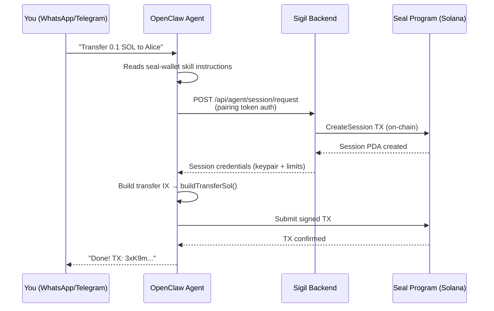

# OpenClaw Integration

Connect [OpenClaw](https://openclaw.ai) (self-hosted AI gateway) to your Seal smart wallet. This lets you control your wallet from **WhatsApp, Telegram, Discord, Slack** — any channel OpenClaw supports.

## How It Works



## Quick Setup

### 1. Give OpenClaw the Skill

Tell OpenClaw to read the skill from your Seal docs site:

> "Read the Seal wallet skill at `https://seal.scrolls.fun/seal-wallet-skill.md` and use it to control my wallet."

Or install it locally:

```bash
mkdir -p ~/.openclaw/skills/seal-wallet
curl -o ~/.openclaw/skills/seal-wallet/SKILL.md \
  https://seal.scrolls.fun/seal-wallet-skill.md
```

### 2. Provide the Pairing Token

Either tell OpenClaw directly:

> "My Seal pairing token is `sgil_abc123...`"

Or set it in `~/.openclaw/openclaw.json`:

```json
{
  "skills": {
    "entries": {
      "seal-wallet": {
        "enabled": true,
        "env": {
          "SEAL_PAIRING_TOKEN": "sgil_YOUR_TOKEN_HERE",
          "SIGIL_API_URL": "https://your-sigil-backend.up.railway.app"
        }
      }
    }
  }
}
```

### 3. Use It

Message OpenClaw from any connected channel:

- *"Check my Seal wallet balance"*
- *"Transfer 0.1 SOL to `GkXn6...`"*
- *"Open an LP position on SOL-USDC"*

OpenClaw reads the skill instructions, writes a TypeScript script using `seal-wallet-agent-sdk`, executes it, and reports back.

## What the Skill Teaches

The [skill file](/seal-wallet-skill.md) instructs the agent to:

| Operation | Method |
|-----------|--------|
| Initialize | `new SigilAgent({ pairingToken })` |
| Get session | `agent.getSession({ maxAmountSol, maxPerTxSol })` |
| Transfer SOL | `agent.buildTransferSol(destination, amount)` |
| DLMM LP | `DLMM.initializePositionAndAddLiquidityByStrategy()` → `agent.wrapInstruction()` |
| Heartbeat | `agent.heartbeat("trading", { action: "..." })` |

## Security

All spending limits are enforced **on-chain** by the Seal program. The agent physically cannot exceed the limits set in the session, regardless of what OpenClaw tells it to do.

| Layer | Protection |
|-------|------------|
| Pairing token | Bcrypt-hashed on backend |
| Session keys | AES-256-GCM encrypted at rest, ephemeral |
| Spending limits | Enforced on-chain (tamper-proof) |
| Wallet lock | Owner can lock wallet instantly from Sigil app |

## Requirements

- OpenClaw running (`openclaw gateway`)
- Sigil backend accessible (not localhost — deploy to Railway/Render/Fly.io)
- `seal-wallet-agent-sdk` + `@solana/web3.js` installed in OpenClaw workspace
- A pairing token from the Sigil mobile app
