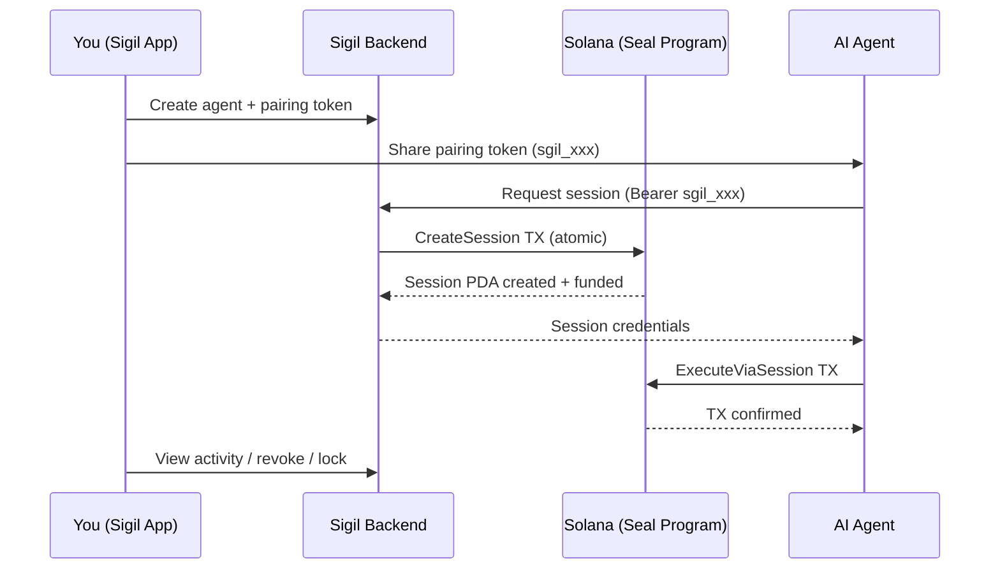

# Sigil — Agent Wallet Management

**[sigil.scrolls.fun](https://sigil.scrolls.fun)**

Sigil is the companion mobile app for Seal. It makes giving an agent a wallet as easy as creating a Telegram bot.

## Demo

<div style="position: relative; padding-bottom: 56.25%; height: 0; overflow: hidden; max-width: 100%; border-radius: 8px; margin: 1.5rem 0;">
  <iframe
    src="https://www.youtube.com/embed/bgC_f6LuOlc"
    style="position: absolute; top: 0; left: 0; width: 100%; height: 100%; border: 0;"
    allow="accelerometer; autoplay; clipboard-write; encrypted-media; gyroscope; picture-in-picture"
    allowfullscreen
    title="Sigil Demo — Agentic Wallet in Action"
  ></iframe>
</div>

> An AI agent (via OpenClaw) transfers SOL from a Seal wallet, authorized by a session key created in Sigil. No seed phrases, no raw keypairs — just a pairing token.

## The Problem Sigil Solves

Seal gives you the on-chain program — session keys, spending limits, all enforced by the Solana runtime. But the agent still needs a wallet to interact with it in the first place.

Setting up an agent wallet without Sigil means: generate a keypair, fund it, register it on-chain, create a session, scope the permissions — all before the agent can do anything. That's not how this scales to people vibecoding agents.

Sigil reduces it to:

```
Skill file ➩ Pairing token ➩ Agent gets wallet control from anywhere
```

## How It Works

1. **Connect your wallet** in the Sigil app (Phantom, Solflare, or any Solana wallet)
2. **Create an agent** — set a name, daily spending limit, per-transaction cap
3. **Generate a pairing token** (`sgil_xxx`) — this is all the agent needs
4. **Hand the token to the agent** — via environment variable, config file, or message

The agent uses the `seal-wallet-agent-sdk`:

```typescript
import { SigilAgent } from "seal-wallet-agent-sdk";

const agent = new SigilAgent({
  pairingToken: "sgil_abc123...",
});

// That's it. The agent has a wallet.
const balance = await agent.getWalletBalance();
const sig = await agent.sendTransferSol("RecipientAddress", 0.1);
```

## What You Control

From the Sigil app, wallet owners have full control:

| Feature | Description |
|---------|-------------|
| **Spending limits** | Daily cap and per-transaction cap per agent |
| **Program allowlists** | Restrict which Solana programs the agent can call |
| **Session management** | View active sessions, revoke any session instantly |
| **Wallet lock** | Emergency freeze — blocks all agent operations |
| **Activity feed** | Real-time log of every action the agent takes |
| **Withdraw** | Pull funds from the Seal wallet back to your personal wallet |

## Architecture



## SDK

The agent-side SDK handles authentication, session management, and transaction building:

```bash
npm install seal-wallet-agent-sdk @solana/web3.js
```

See the [SDK README](https://www.npmjs.com/package/seal-wallet-agent-sdk) or the [Seal Wallet Skill](/seal-wallet-skill.md) for full usage instructions.
