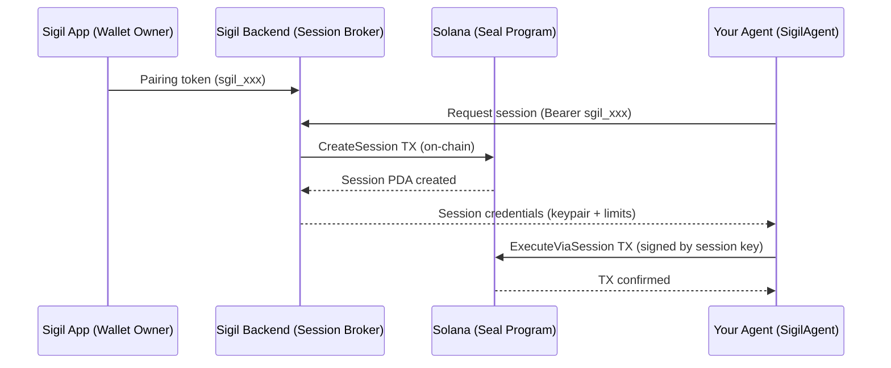

# seal-wallet-agent-sdk

Lightweight SDK for AI agents and bots to authenticate with [Seal](https://github.com/seal-wallet) smart wallets on Solana via the Sigil pairing token flow.

## Overview

Seal wallets are on-chain smart wallets with **session-based authorization**, **spending limits**, and **allowed-program enforcement**. The Sigil system provides a secure pairing flow where wallet owners grant agents ephemeral sessions via **pairing tokens**.

This SDK handles the entire agent-side flow:

- **Authenticate** with a pairing token (no private keys needed)
- **Obtain ephemeral sessions** with on-chain spending limits
- **Wrap instructions** through Seal's `ExecuteViaSession` CPI
- **Auto-renew** sessions before they expire
- **Heartbeat** to report agent status



## Installation

```bash
npm install seal-wallet-agent-sdk @solana/web3.js
```

## Quick Start

```typescript
import { SigilAgent } from "seal-wallet-agent-sdk";

// 1. Initialize with pairing token from Sigil app
const agent = new SigilAgent({
  pairingToken: process.env.PAIRING_TOKEN!, // sgil_xxx format
  // rpcUrl defaults to mainnet-beta, apiUrl defaults to production backend
});

// 2. Transfer SOL — one line, handles everything
const sig = await agent.sendTransferSol("RecipientAddressHere", 0.1); // 0.1 SOL
console.log(`Transfer sent: ${sig}`);

// 3. Check wallet balance
const balance = await agent.getWalletBalance();
console.log(`Wallet has ${balance} SOL`);
```

## API Reference

### `new SigilAgent(config)`

| Parameter | Type | Default | Description |
|-----------|------|---------|-------------|
| `pairingToken` | `string` | *required* | Pairing token from Sigil app (`sgil_xxx` format) |
| `apiUrl` | `string` | `https://sigil-backend-production-fd3d.up.railway.app` | Sigil backend URL |
| `rpcUrl` | `string` | `https://api.mainnet-beta.solana.com` | Solana RPC URL (mainnet-beta default; pass devnet URL for testing) |
| `autoRefresh` | `boolean` | `true` | Auto-renew session before expiry |
| `refreshThresholdSecs` | `number` | `300` | Seconds before expiry to trigger renewal |

### `agent.getSession(options?)`

Requests or returns a cached ephemeral session. If the current session is within `refreshThresholdSecs` of expiry, a new one is created automatically.

**Options:**

| Parameter | Type | Default | Description |
|-----------|------|---------|-------------|
| `durationSecs` | `number` | `86400` | Session duration (60s – 7 days) |
| `maxAmountSol` | `number` | `5.0` | Max total SOL for this session |
| `maxPerTxSol` | `number` | `1.0` | Max SOL per single transaction |

**Returns:**

```typescript
{
  credentials: SessionCredentials; // Full session metadata
  sessionKeypair: Keypair;         // For signing transactions
  walletPda: PublicKey;            // Seal wallet PDA (use as authority)
  agentConfigPda: PublicKey;       // Agent config PDA
}
```

**Throws:**

- `Error("Session request pending manual approval...")` if the agent's `autoApprove` is `false` — the wallet owner must approve in the Sigil app.
- `Error("Session request failed: ...")` on backend/network errors (automatically retried up to 3 times with exponential backoff).

### `agent.buildTransferSol(destination, amountLamports)`

Builds a `TransferLamports` instruction (disc 13) to move SOL from the Seal wallet PDA to a destination. This is the low-level method — prefer `sendTransferSol()` for simple transfers. Do **not** use `SystemProgram.transfer` because the wallet PDA carries on-chain data, and the System Program rejects transfers from accounts with data.

| Parameter | Type | Description |
|-----------|------|-------------|
| `destination` | `PublicKey` | Recipient address |
| `amountLamports` | `bigint` | Amount of lamports to transfer |

### `agent.sendTransferSol(destination, amountSol)` ⭐ Recommended

**High-level convenience method.** Transfers SOL from the Seal wallet to a destination. Handles session management, TX building, signing, and submission automatically.

| Parameter | Type | Description |
|-----------|------|-------------|
| `destination` | `PublicKey \| string` | Recipient address (PublicKey or base58 string) |
| `amountSol` | `number` | Amount in SOL (e.g. `0.5` for half a SOL) |

**Returns:** `Promise<string>` — Transaction signature.

### `agent.getWalletBalance()`

Returns the SOL balance of the Seal wallet PDA.

**Returns:** `Promise<number>` — Balance in SOL.

### `agent.getSessionBalance()`

Returns the SOL balance of the session keypair (used for TX fees).

**Returns:** `Promise<number>` — Balance in SOL.

### `agent.getConnection()`

Returns the Solana `Connection` instance (lazily created). Useful when you need to submit custom transactions or query on-chain data.

### `agent.wrapInstruction(innerIx, amountLamports?)`

Wraps a `TransactionInstruction` inside Seal's `ExecuteViaSession` CPI envelope. Use this for DeFi interactions (DLMM, swap programs, etc.) — **not** for SOL transfers (use `buildTransferSol` instead). The Seal program verifies:

- Session key is valid and not expired
- Amount is within per-TX and daily limits
- Target program is in the agent's `allowed_programs` list (default: all allowed)

| Parameter | Type | Default | Description |
|-----------|------|---------|-------------|
| `innerIx` | `TransactionInstruction` | *required* | The instruction to execute |
| `amountLamports` | `bigint` | `0n` | Amount of lamports being spent |

### `agent.heartbeat(status?, metadata?)`

Sends a keepalive to the Sigil backend. Shows up in the wallet owner's activity feed.

| Parameter | Type | Default | Description |
|-----------|------|---------|-------------|
| `status` | `"active" \| "idle" \| "trading"` | `"active"` | Agent status |
| `metadata` | `Record<string, unknown>` | — | Custom metadata (pool name, action, etc.) |

### `agent.isSessionValid()`

Returns `true` if the cached session has not expired.

### `agent.getSessionKeypair()`

Returns the current session `Keypair`. Throws if no session is active.

### `agent.getWalletPda()`

Returns the Seal wallet `PublicKey`. Throws if no session is active.

## Meteora DLMM Integration

The primary use case is autonomous LP trading on Meteora DLMM pools:

```typescript
import DLMM from "@meteora-ag/dlmm";
import { SigilAgent } from "seal-wallet-agent-sdk";
import { Connection, Keypair, Transaction } from "@solana/web3.js";
import BN from "bn.js";

const agent = new SigilAgent({ pairingToken: process.env.PAIRING_TOKEN! });
const session = await agent.getSession({ maxAmountSol: 2.0 });
const connection = new Connection("https://api.mainnet-beta.solana.com");

// Load DLMM pool
const poolAddress = new PublicKey("POOL_ADDRESS_HERE");
const dlmm = await DLMM.create(connection, poolAddress);

// Build add-liquidity instructions with Seal wallet PDA as user
const positionKeypair = Keypair.generate();
const { instructions } = await dlmm.initializePositionAndAddLiquidityByStrategy({
  positionPubKey: positionKeypair.publicKey,
  user: session.walletPda,           // Seal wallet PDA is the authority
  totalXAmount: new BN(0.5 * 1e9),   // 0.5 SOL
  totalYAmount: new BN(0),
  strategy: {
    maxBinId: activeBin.binId + 10,
    minBinId: activeBin.binId - 10,
    strategyType: StrategyType.SpotBalanced,
  },
});

// Wrap EACH instruction through Seal's ExecuteViaSession
const wrappedInstructions = instructions.map((ix) =>
  agent.wrapInstruction(ix, 500_000_000n) // 0.5 SOL
);

const tx = new Transaction().add(...wrappedInstructions);
tx.feePayer = session.sessionKeypair.publicKey;

await connection.sendTransaction(tx, [session.sessionKeypair, positionKeypair]);
```

## Session Auto-Renewal

Sessions are ephemeral and have an expiry time. The SDK automatically renews them:

```typescript
const agent = new SigilAgent({
  pairingToken: "sgil_xxx",
  autoRefresh: true,           // default
  refreshThresholdSecs: 300,   // renew 5 min before expiry (default)
});

// First call creates a session
const s1 = await agent.getSession();

// Subsequent calls return cached session
const s2 = await agent.getSession(); // same session (if still valid)

// When session nears expiry, a new one is automatically created
// No manual session management needed
```

## Error Handling & Retry

The SDK includes built-in retry with exponential backoff for transient failures:

- **Network errors**: Retried up to 3 times (1s → 2s → 4s backoff)
- **5xx server errors**: Retried with backoff
- **4xx client errors**: NOT retried (invalid token, locked wallet, etc.)

```typescript
try {
  const session = await agent.getSession();
} catch (err) {
  if (err.message.includes("pending manual approval")) {
    // Agent's autoApprove is false — owner must approve in Sigil app
  } else if (err.message.includes("Wallet is locked")) {
    // Owner locked the wallet — agent cannot create sessions
  } else {
    // Network/server error after 3 retries
  }
}
```

## Security Model

| Feature | Protection |
|---------|------------|
| Pairing tokens | Bcrypt-hashed, never stored in plaintext |
| Session keys | AES-256-GCM encrypted at rest on backend |
| Session secret delivery | Transmitted once over HTTPS, never logged |
| Spending limits | Enforced on-chain by Seal program (tamper-proof) |
| Allowed programs | On-chain whitelist — agent can only call approved programs |
| Wallet lock | Owner can instantly lock wallet, blocking all new sessions |
| Session revocation | Owner can revoke individual or all sessions instantly |

## Examples

See the [examples/](./examples/) directory:

- [`demo.ts`](./examples/demo.ts) — Full SDK lifecycle demo
- [`meteora-integration.ts`](./examples/meteora-integration.ts) — Meteora DLMM integration pattern

```bash
# Run the demo
PAIRING_TOKEN=sgil_xxx npx tsx examples/demo.ts

# Run with on-chain transaction
PAIRING_TOKEN=sgil_xxx npx tsx examples/demo.ts --send
```

## License

MIT
